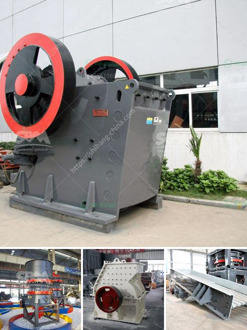

<h3>rock crushers for making gravel</h3>
Rock crushers are first categorized by the general crushing mechanism. Compression crushers include jaw crushers, cone crushers, gyratory crushers, and roll crushers. Impact crushers include vertical shaft impactors or horizontal shaft impactors.

Rock crushers means mechanical devices that help break down larger pieces of rocks into more manageable sizes. Rock crushers are widely used in industries like mining and construction where larger rocks need to be reduced to smaller particles to facilitate further processing.

One common type of rock crusher is a jaw crusher. This machine uses a moving jaw to exert pressure on the rock material, which forces it against the stationary plate. The rocks then break down into smaller pieces for easier handling and processing. Jaw crushers are commonly used for primary crushing stages.

Another type of rock crusher is a cone crusher. This machine works similarly to a gyratory crusher but has a conical-shaped chamber with a rotating eccentrically driven head. The rocks are crushed between the mantle and the concave liner. Cone crushers are often used in secondary or tertiary crushing stages.

Gyratory crushers are large rock crushers that have a conical mantle and a concave liner. The rocks are crushed between the mantle and the concave liner. Gyratory crushers are typically used in primary crushing applications where large rocks are fed into the crusher.

Impact crushers are versatile machines that can handle various types of rocks. These crushers use impact force to break down the rocks. They can be divided into two main categories: horizontal shaft impactors and vertical shaft impactors. Horizontal shaft impactors use a horizontal rotating shaft that imparts impact force onto the rock, causing it to break. Vertical shaft impactors use a vertical rotating shaft that throws the rock against a hard surface, causing it to break.

Rock crushers are essential tools in the mining and construction industry for breaking down rocks into more manageable sizes. Whether it is for generating gravel for construction projects or crushing rocks for aggregate production, these machines play a vital role in many industries. With various types of crushers available, there is always a suitable rock crusher for specific needs.
<h3>Contact us</h3><ul><li><strong>Whatsapp:&nbsp;<a href="https://wa.me/8613661969651">+8613661969651</a></strong></li><li><a href="https://swt.shibang-china.com/?git&amp;zhl&amp;rock crushers for making gravel"><strong>Online Service(chat now)</strong></a></li></ul><h3>Related</h3><ul><li><a href='belt and conveyor distributor in indonesia.md'>belt and conveyor distributor in indonesia</a></li><li><a href='ball mill grinding media work.md'>ball mill grinding media work</a></li><li><a href='mining equipment for hire in kenya.md'>mining equipment for hire in kenya</a></li><li><a href='used silica crushing plants for sale.md'>used silica crushing plants for sale</a></li><li><a href='ball grinder machine.md'>ball grinder machine</a></li></ul>