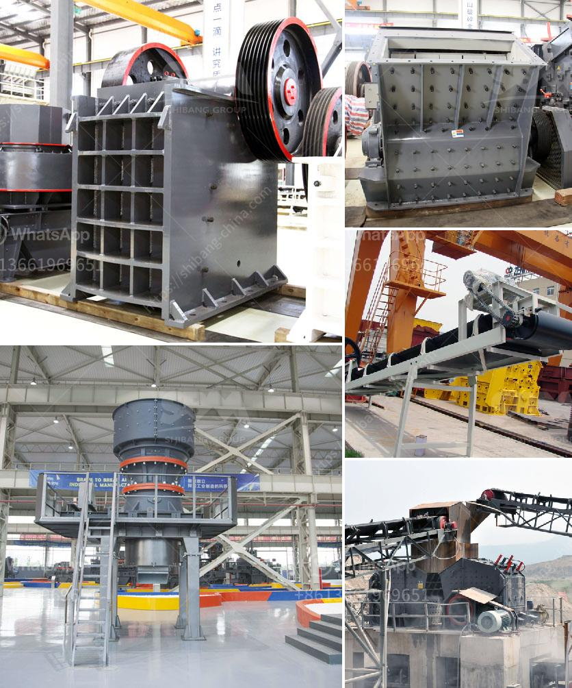

<h3>rock crushers uk</h3>
Rock crushers have become an integral part of the construction, mining, and quarrying industries these days by efficiently reducing the size of rock materials into smaller, more manageable particles. The United Kingdom has a thriving market for rock crushers due to its growing infrastructure projects, roads, bridges, and new construction developments. In this article, we will discuss the importance of rock crushers in the UK and highlight some of the top models available in the market.

Rock crushers serve a crucial role in various industries, including mining, where large rocks are extracted from the earth's core. These enormous rocks need to be broken down into smaller, more manageable sizes, making them suitable for further processing. Similarly, in construction and quarrying, crushers are used to convert large rocks into smaller aggregates, which are then used for building roads, foundations, and structures.

One of the leading players in the rock crusher industry is the United Kingdom, globally recognized for its robust infrastructure and construction projects. The demand for high-quality aggregates, crushed stones, and sand in the UK is ever-growing, making rock crushers indispensable for maintaining a steady supply of materials. The efficiency and reliability of rock crushers have significantly contributed to the development and success of these projects.

Various types of rock crushers are used in the UK, each with their own unique specifications and features. Let's take a closer look at some of the top models.

1. Jaw Crushers: These crushers are commonly used in construction and mining industries. They offer high crushing ratios, enabling them to process large rocks efficiently. Jaw crushers feature a fixed plate and a movable plate, which, when combined, create a V-shaped cavity for the rocks to be crushed.

2. Cone Crushers: Designed for secondary and tertiary crushing, cone crushers are widely used in quarrying and mining operations. They compress the rocks between a rotating mantle and a stationary concave, producing finely crushed products. This type of crusher is known for its versatility and high production capacity.

3. Impact Crushers: These crushers are known for their exceptional crushing capabilities, particularly when dealing with softer materials. Impact crushers use a high-speed rotor and anvils to achieve their crushing action, resulting in a high-quality product shape. They are commonly used in recycling applications and construction projects.

4. Mobile Crushers: The advent of mobile technology has revolutionized the rock crushing industry. Mobile crushers allow operators to move the crushing operations directly to the site, eliminating the need for transportation. They offer increased flexibility and convenience, making them ideal for construction projects in remote or inaccessible locations.

In conclusion, rock crushers play a vital role in the UK's construction, mining, and quarrying industries. They enable the efficient reduction of large rocks into smaller, more manageable particles that can be used as aggregates in various applications. With the growing demand for quality materials, the UK's market for rock crushers continues to thrive, driven by infrastructure projects and construction developments. The availability of different types of crushers, such as jaw crushers, cone crushers, impact crushers, and mobile crushers, provides operators with versatile options to meet their specific crushing needs.
<h3>Contact us</h3><ul><li><strong>Whatsapp:&nbsp;<a href="https://wa.me/8613661969651">+8613661969651</a></strong></li><li><a href="https://swt.shibang-china.com/?git&amp;zhl&amp;rock crushers uk"><strong>Online Service(chat now)</strong></a></li></ul><h3>Related</h3><ul><li><a href='gypsum grinding machine.md'>gypsum grinding machine</a></li><li><a href='hammer mill 40 ton hour.md'>hammer mill 40 ton hour</a></li><li><a href='selling cone crusher made in china.md'>selling cone crusher made in china</a></li><li><a href='iron ore processing pdf.md'>iron ore processing pdf</a></li><li><a href='feldspar grinding mill suppliers india.md'>feldspar grinding mill suppliers india</a></li></ul>