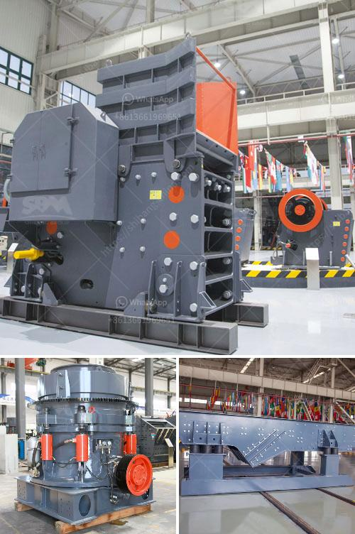

<h3>rock crushing machine price</h3>
The rock crushing machine price is determined by several factors including the machine's capacity, fuel consumption, size and dimensions, manufacturer and the overall cost of manufacturing the equipment. Although each machine is unique, these factors will greatly influence the rock crusher price.

Capacity: The price of rock crushing machines varies significantly based on the different capacities available. Some machines are able to crush rocks into more fine particles, while others can only accept larger rocks. Machines with higher capacities are generally more expensive due to their ability to process larger quantities of material in a shorter amount of time.

Fuel Consumption: Another important factor that impacts the price of rock crushing machines is the amount of fuel they consume. Machines that require more fuel to operate are typically more expensive to run, and as a result, their purchase price may be higher. It is therefore crucial to determine the fuel consumption of a machine before purchasing it to ensure that it fits within your budget.

Size and Dimensions: The size and dimensions of a rock crushing machine greatly impact its price. Smaller machines are generally less expensive because they require less material to manufacture. However, larger machines often have greater capacities and can therefore produce more crushed material in less time, which may be worth the higher price tag for some users.

Manufacturer: The manufacturer of a rock crushing machine can also influence its price. Well-established and reputable manufacturers may charge more for their machines due to their brand reputation and higher quality standards. However, these machines are often more durable and reliable, resulting in increased longevity and potential savings in maintenance and repair costs.

Overall Cost of Manufacturing: The overall cost of manufacturing the rock crushing machine also affects its price. This includes factors such as labor costs, raw material costs, and operating expenses. Machines that require more intricate manufacturing processes or expensive materials may be priced higher to recover these costs.

In conclusion, the price of a rock crushing machine is determined by various factors. By considering the machine's capacity, fuel consumption, size and dimensions, manufacturer, and the overall cost of manufacturing, you can make an informed decision when purchasing a rock crusher. It is important to weigh these factors against your specific needs and budget to ensure you choose the most cost-effective option that meets your requirements.
<h3>Contact us</h3><ul><li><strong>Whatsapp:&nbsp;<a href="https://wa.me/8613661969651">+8613661969651</a></strong></li><li><a href="https://swt.shibang-china.com/?git&amp;zhl&amp;rock crushing machine price"><strong>Online Service(chat now)</strong></a></li></ul><h3>Related</h3><ul><li><a href='project proposal for gypsum manufacturing.md'>project proposal for gypsum manufacturing</a></li><li><a href='stone crushing business in pakistan.md'>stone crushing business in pakistan</a></li><li><a href='ball mills caractecrsistiacs techniques.md'>ball mills caractecrsistiacs techniques</a></li><li><a href='how much a stone crusher cost.md'>how much a stone crusher cost</a></li><li><a href='used concrete crusher manufacturer in malaysia.md'>used concrete crusher manufacturer in malaysia</a></li></ul>