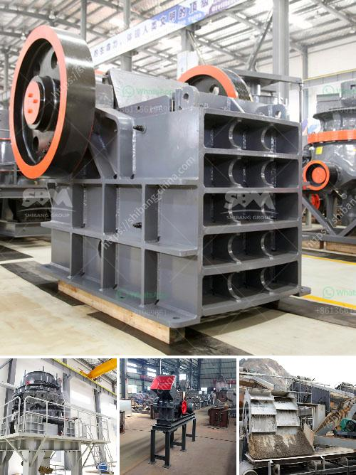

<h3>rock crushing plants</h3>
Rock crushing plants, also known as rock crushers, are essential to any construction activity. These plants are specifically designed to crush larger rocks into smaller gravels or stones that can be used for various purposes such as road construction, concrete production, and landscaping.

One of the primary reasons why rock crushing plants are essential in construction is their ability to turn large rocks into more manageable sizes. During the initial stages of a construction project, it is often necessary to break down large rocks or boulders to create a suitable foundation or base. Rock crushers utilize a mechanical process to apply force and pressure on rocks until they break apart.

There are various types of rock crushing plants available in the market, each with different features and capabilities. Jaw crushers, one of the most popular types of rock crushers, are primarily used in primary crushing applications. They are renowned for their reliability and flexibility, allowing them to handle a wide range of materials, including hard rock and recycled concrete.

Cone crushers, on the other hand, are ideal for secondary and tertiary crushing applications. These crushers are capable of producing highly precise and consistent end products, making them suitable for producing aggregates and manufacturing concrete. Additionally, cone crushers are often combined with a screening unit to create a complete crushing and screening plant.

Impact crushers are another type of rock crushing plant commonly used in construction. These crushers utilize the principle of impact to reduce the size of rocks. In comparison to jaw and cone crushers, impact crushers generally have a higher production capacity and are more efficient at producing cubical-shaped end products. This makes them suitable for applications requiring high-quality aggregates for concrete production.

Apart from their primary crushing capabilities, rock crushing plants also offer other advantages. For instance, many modern crushers can be operated remotely, reducing the need for on-site personnel and increasing overall safety. Additionally, some crushers are equipped with dust suppression systems, which help minimize the emission of dust particles, creating a healthier work environment.

Furthermore, rock crushing plants are designed to be mobile, allowing them to be transported to various construction sites. This enables construction companies to save time and money by avoiding the need to transport large rocks and materials over long distances. Moreover, mobile crushing plants can be set up quickly and easily, allowing construction projects to commence faster.

In conclusion, rock crushing plants play a crucial role in construction activities by turning large rocks into smaller, more manageable sizes. These plants come in various types and sizes, each designed for specific applications. From jaw crushers to cone crushers and impact crushers, rock crushing plants offer a wide range of capabilities suitable for different construction needs. With their ability to produce high-quality aggregates, increase efficiency, and improve safety, rock crushing plants are an essential component of any construction project.
<h3>Contact us</h3><ul><li><strong>Whatsapp:&nbsp;<a href="https://wa.me/8613661969651">+8613661969651</a></strong></li><li><a href="https://swt.shibang-china.com/?git&amp;zhl&amp;rock crushing plants"><strong>Online Service(chat now)</strong></a></li></ul><h3>Related</h3><ul><li><a href='mobile vertical roller mill.md'>mobile vertical roller mill</a></li><li><a href='hammer mill in malaysia.md'>hammer mill in malaysia</a></li><li><a href='trommel ball mill.md'>trommel ball mill</a></li><li><a href='bauxite beneficiation plant.md'>bauxite beneficiation plant</a></li><li><a href='jaw stone crusher zimbabwe.md'>jaw stone crusher zimbabwe</a></li></ul>