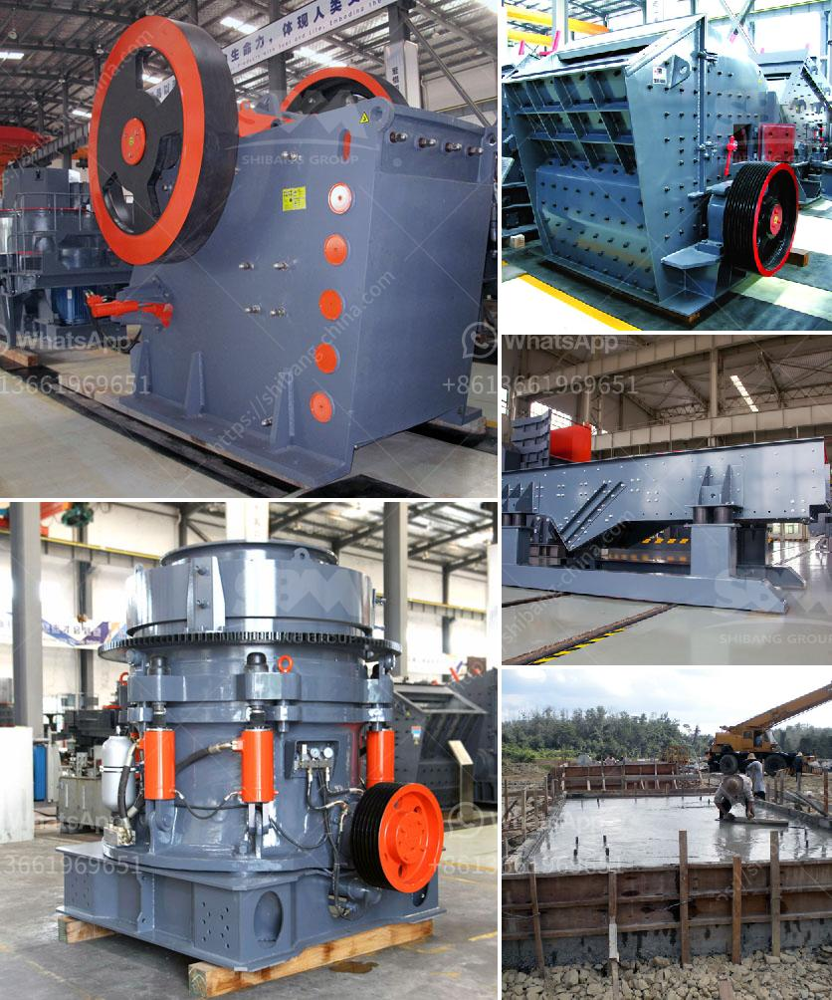

<h3>rock drills for sale in south africa</h3>
Rock drilling is an essential component of various industries, including mining, construction, and exploration. To meet the high demand for efficient drilling equipment, the market in South Africa offers a variety of rock drills for sale. These powerful machines are designed to tackle even the toughest drilling tasks and deliver optimal results.

One reliable place to explore rock drills for sale in South Africa is through reputable suppliers. These suppliers often possess a wide range of rock drilling equipment suitable for different applications. From surface drilling to underground operations, there is a drill available to match specific project requirements.

Rock drills for sale in South Africa vary in size, power, and functionality. Buyers can choose between electric, pneumatic, and hydraulic models, depending on their needs. Electric rock drills are popular for their convenience and versatility, especially in areas where a power source is readily available. Pneumatic drills, on the other hand, are favored for their durability and ability to withstand harsh working conditions. Hydraulic drills provide incredible power and efficiency, making them ideal for heavy-duty drilling projects.

In addition to choosing the right type of drill, buyers should also consider other features such as drilling capacity, drilling speed, and drilling angle. These factors determine the machine's effectiveness and help operators achieve desired results efficiently.

When making a purchase, it is crucial to ensure that the rock drill is manufactured by a reputable brand known for quality and durability. Investing in a reliable drill may initially cost more but can save money in the long run by reducing maintenance and replacement costs.

In conclusion, South Africa offers a diverse range of rock drills for sale to cater to the needs of various industries. With the right research and understanding of specific requirements, buyers can select the most suitable rock drill to enhance productivity and achieve project success.
<h3>Contact us</h3><ul><li><strong>Whatsapp:&nbsp;<a href="https://wa.me/8613661969651">+8613661969651</a></strong></li><li><a href="https://swt.shibang-china.com/?git&amp;zhl&amp;rock drills for sale in south africa"><strong>Online Service(chat now)</strong></a></li></ul><h3>Related</h3><ul><li><a href='stone crusher pricetonnes capacity per hour.md'>stone crusher pricetonnes capacity per hour</a></li><li><a href='sand mills for manufacturing.md'>sand mills for manufacturing</a></li><li><a href='crushing plant pdf.md'>crushing plant pdf</a></li><li><a href='suplier sand making machine from philippines.md'>suplier sand making machine from philippines</a></li><li><a href='ball mill feed spout seal.md'>ball mill feed spout seal</a></li></ul>