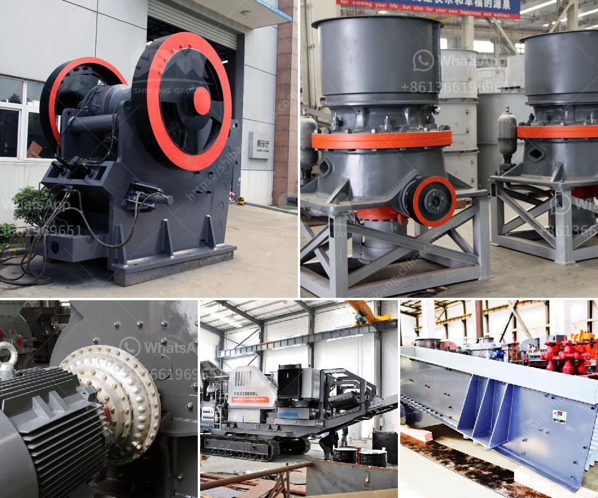

<h3>rock miller machine</h3>
Rock miller machines, also known as rock crushing machines, are powerful tools used in the mining and construction industries. These machines are specifically designed to break down large rocks into smaller, more manageable sizes for further processing or usage. With their robust structure and reliable performance, rock miller machines are essential equipment for any job site that involves rock excavation.

One of the key features of rock miller machines is their impressive crushing capacity. These machines are equipped with powerful jaw or impact crushers that can efficiently crush even the hardest rocks. By applying mechanical force, the crushers break down the rocks into smaller pieces, making it easier to handle and transport them. This process is essential in mining, where rocks need to be extracted and processed for various purposes such as building materials and mineral extraction.

The versatility of rock miller machines is also noteworthy. These machines can be used for various applications, including road construction, foundation building, and landscaping. With different attachments and configurations available, rock miller machines can be adjusted to meet specific needs, making them a valuable asset in any construction project. Whether it's crushing rocks to create road base or preparing aggregates for concrete production, these machines deliver consistent and high-quality results.

In addition to their crushing capabilities, rock miller machines are designed with operator safety in mind. They are equipped with advanced safety features to protect workers from potential hazards. These features may include safety guards, emergency stop buttons, and automatic shutdown systems in case of abnormal operating conditions. As a result, operators can work confidently and efficiently, knowing that their safety is ensured.

Another important aspect of rock miller machines is their fuel efficiency. With rising fuel costs and environmental concerns, it's crucial for machines to be as energy-efficient as possible. Most modern rock miller machines are designed to minimize fuel consumption while maintaining high productivity levels. This not only reduces operating costs but also minimizes the carbon footprint associated with the machine's operation.

Maintenance is also a key factor in ensuring the longevity and reliability of rock miller machines. Regular maintenance and inspections are necessary to keep the machines in optimal working condition. Proper lubrication, filter replacements, and component inspections are crucial to prevent breakdowns and ensure smooth operation. Many manufacturers provide detailed maintenance guidelines and support, allowing machine owners to keep their equipment running smoothly and efficiently.

In conclusion, rock miller machines are powerful and versatile tools that play a crucial role in various industries. These machines enable efficient rock crushing, making it easier to handle, transport, and process rocks for various applications. With their robust structure, operator safety features, fuel efficiency, and proper maintenance, rock miller machines are a valuable asset that can significantly enhance productivity on any job site. Whether it's mining, construction, or landscaping, these machines have proven their worth and continue to be a dependable solution for rock crushing needs.
<h3>Contact us</h3><ul><li><strong>Whatsapp:&nbsp;<a href="https://wa.me/8613661969651">+8613661969651</a></strong></li><li><a href="https://swt.shibang-china.com/?git&amp;zhl&amp;rock miller machine"><strong>Online Service(chat now)</strong></a></li></ul><h3>Related</h3><ul><li><a href='rock crusher hammer mills for sale.md'>rock crusher hammer mills for sale</a></li><li><a href='contact list of mining companies in germany.md'>contact list of mining companies in germany</a></li><li><a href='used cement grinding mill for sale in uae.md'>used cement grinding mill for sale in uae</a></li><li><a href='gold wash plant for sale canada.md'>gold wash plant for sale canada</a></li><li><a href='setting up a coal mining plant.md'>setting up a coal mining plant</a></li></ul>