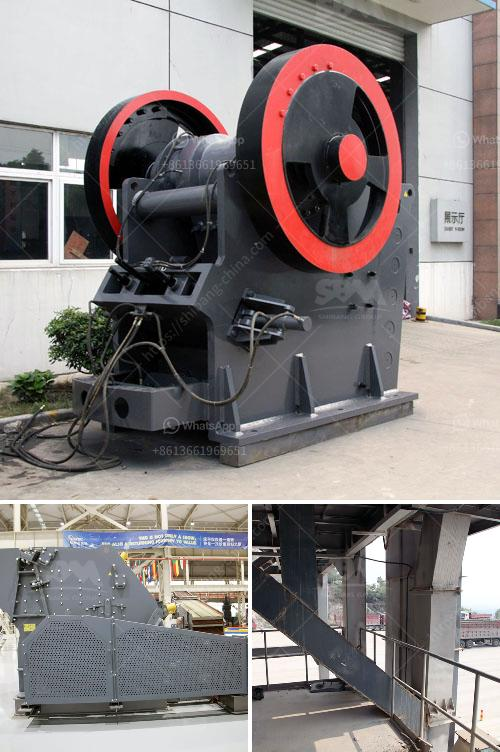

<h3>rock processing plant</h3>
The mining industry is essential for fulfilling the world's demand for various minerals and materials used in construction, manufacturing, and industrial processes. However, this industry is constantly evolving, and new technologies are continuously revolutionizing the way we extract and process rocks. One such innovation is the rock processing plant, a game-changer in the mining sector.

A rock processing plant refers to a facility where rocks and minerals are extracted, sorted, crushed, and processed to create final products that meet specific industrial standards. This plant plays a crucial role in the mining process, as it enables the efficient extraction of valuable minerals from the earth and the transformation of these raw materials into usable products.

One primary advantage of a rock processing plant is its ability to process large quantities of rocks efficiently and effectively. These facilities are equipped with state-of-the-art machinery and equipment that can handle massive volumes of rocks and minerals. With advanced crushing technology, the rock processing plant can quickly and accurately crush rocks into fine particles of various sizes, depending on the desired end product.

Additionally, the rock processing plant minimizes manual labor and human error, ensuring increased productivity and improved overall efficiency in the mining process. Automation systems streamline operations, reducing the risk of accidents and improving worker safety. This automation allows for continuous operation, 24 hours a day, ensuring a steady supply of processed rocks to meet industry demands.

Furthermore, the rock processing plant plays a vital role in environmental conservation in the mining industry. These facilities are designed to ensure that minimal waste is produced during the extraction and processing of rocks and minerals. Advanced filtering systems and dust suppression technologies are employed to minimize air pollution, while water treatment processes help minimize freshwater usage and protect nearby water bodies from contamination.

The products generated from a rock processing plant cater to a wide range of industries, from construction to manufacturing. Crushed rocks are commonly used in road construction, concrete production, and various infrastructure projects. They are also used as base materials for railways and airports, providing essential support for transportation networks.

In addition to rocks, a rock processing plant can also process minerals like iron ore, gold, copper, and nickel. These minerals are vital for manufacturing various products, including steel, electronics, and renewable energy equipment. By processing minerals, rock processing plants contribute to the growth of multiple sectors, driving economic development and job creation.

In conclusion, the advent of rock processing plants has revolutionized the mining industry. These plants enable efficient extraction and processing of rocks and minerals, resulting in valuable products that contribute to various sectors. From increased productivity and reduced environmental impact to creating job opportunities, the rock processing plant is undoubtedly a game-changer in the world of mining. As the mining industry continues to evolve, such innovations will pave the way for sustainable and efficient resource extraction processes.
<h3>Contact us</h3><ul><li><strong>Whatsapp:&nbsp;<a href="https://wa.me/8613661969651">+8613661969651</a></strong></li><li><a href="https://swt.shibang-china.com/?git&amp;zhl&amp;rock processing plant"><strong>Online Service(chat now)</strong></a></li></ul><h3>Related</h3><ul><li><a href='products of formulation for two roll mill.md'>products of formulation for two roll mill</a></li><li><a href='business plan for gold mining company in zimbabwe.md'>business plan for gold mining company in zimbabwe</a></li><li><a href='limestone grinding raymond mill.md'>limestone grinding raymond mill</a></li><li><a href='rock processing plant.md'>rock processing plant</a></li><li><a href='coal size used for mills.md'>coal size used for mills</a></li></ul>