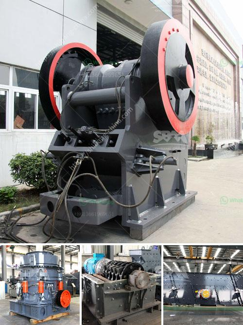

<h3>rock quarry equipment</h3>
A rock quarry is a bustling hub of activity, where rock extraction takes place. There are various types of equipment that are used in a rock quarry, depending on the scale and size of the operation. From excavators and loaders to crushers and conveyors, rock quarry equipment plays a vital role in ensuring efficient and productive operations. Let’s take a closer look at some of the essential components of rock quarry equipment.

1. Excavators: These heavy-duty machines are used for large-scale excavation and are ideal for removing rock, soil, and other materials from the quarry site. Excavators have powerful engines and hydraulic systems that allow them to perform a wide range of tasks, such as digging trenches, loading trucks, and removing overburden.

2. Loaders: Loaders are used to scoop up and load materials into trucks or onto conveyors. They are available in different sizes and capacities, depending on the requirements of the quarry. Loaders are equipped with strong buckets and can handle various materials, including large rocks, sand, and gravel.

3. Crushers: Crushers play a crucial role in breaking down large rocks into smaller, more manageable sizes. Different types of crushers are used in a rock quarry, including jaw crushers, impact crushers, and cone crushers. Each type operates differently, but the end result is the same – breaking down large rocks into smaller pieces that can be further processed.

4. Conveyors: Conveyors are essential for transporting materials within the quarry. They can move materials horizontally or inclined, allowing for efficient and continuous transportation. Conveyors can be customized to suit specific requirements, such as the type of material being transported and the distance it needs to travel.

5. Screens: Screens are used to separate different sizes of crushed rocks or aggregate. They consist of different layers of mesh or perforated plates that allow smaller particles to pass through while retaining larger ones. Screens ensure that the proper sizes of rocks are sent to specific areas for further processing or sale.

6. Drilling equipment: Drilling equipment is used to create holes for blasting or extracting rock. It includes drills, drill bits, and other accessories needed for the drilling process. Drilling equipment is instrumental in preparing the quarry for extraction and ensuring the rock is of the desired quality.

7. Dust control systems: With rock quarrying comes the issue of dust, which needs to be controlled to maintain a safe working environment and minimize air pollution. Dust control systems, such as air filters, water sprays, and ventilation systems, are used to capture and contain dust particles.

In conclusion, rock quarry equipment is an essential part of any quarry operation. From excavators and loaders for extraction to crushers and conveyors for processing, each piece of equipment plays a crucial role in ensuring efficient and productive operations. Whether it's breaking down large rocks, transporting materials, or controlling dust, rock quarry equipment is designed to meet the demands of the industry. By investing in high-quality and reliable equipment, quarry operators can maximize their productivity and profitability while adhering to safety and environmental regulations.
<h3>Contact us</h3><ul><li><strong>Whatsapp:&nbsp;<a href="https://wa.me/8613661969651">+8613661969651</a></strong></li><li><a href="https://swt.shibang-china.com/?git&amp;zhl&amp;rock quarry equipment"><strong>Online Service(chat now)</strong></a></li></ul><h3>Related</h3><ul><li><a href='cobalt mobile crushing plant.md'>cobalt mobile crushing plant</a></li><li><a href='slag crusher for sale.md'>slag crusher for sale</a></li><li><a href='bauxite ore processing equipment price.md'>bauxite ore processing equipment price</a></li><li><a href='copper ore processing machines in usa.md'>copper ore processing machines in usa</a></li><li><a href='mineral that is used to make talcum powder.md'>mineral that is used to make talcum powder</a></li></ul>