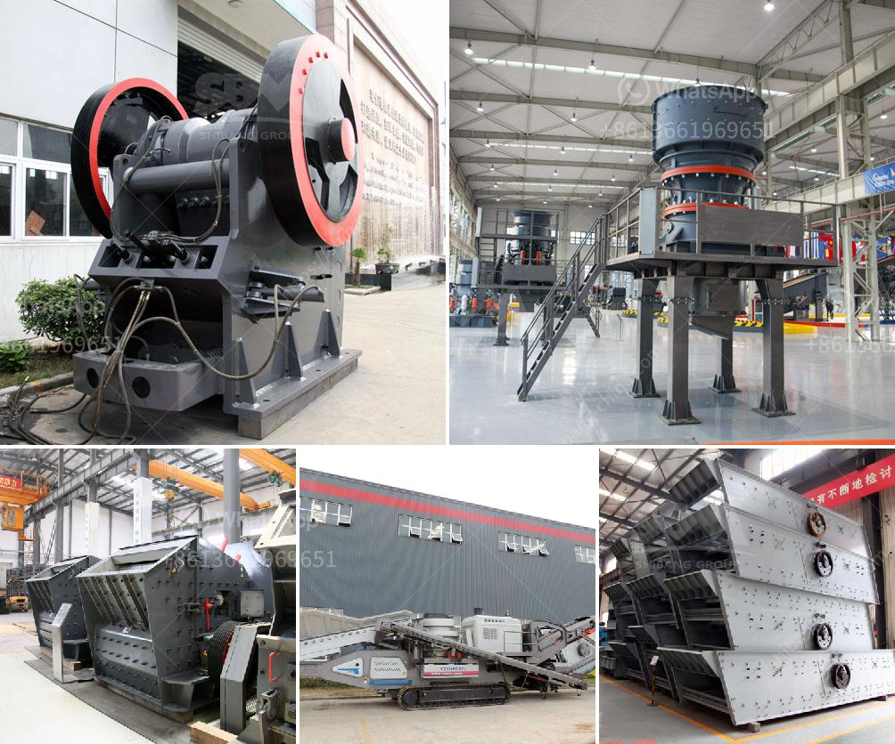

<h3>rock quarry plant</h3>
Rock quarry plants play a vital role in the construction and mining industries, supplying much-needed materials for various projects. These plants extract limestone, granite, gravel, and other rocks from the earth's crust to produce aggregates of different sizes and qualities.

A well-designed rock quarry plant can significantly boost efficiency and productivity, ensuring the steady supply of essential construction materials. Let's explore some key features that make these plants essential for the industry.

Firstly, a rock quarry plant is equipped with heavy machinery capable of efficiently extracting, crushing, and screening rocks. Powerful excavators and loaders are used to remove rocks from the ground, which are then transported to crushers for further processing. Next, screening equipment separates different sizes of aggregates to meet specific project requirements.

To enhance productivity, rock quarry plants often integrate automation and control systems. These advanced technologies streamline operations, reduce manual labor, and allow operators to monitor and control the entire production process from a centralized location. Moreover, sophisticated software can optimize the scheduling of blasts and equipment maintenance, minimizing downtime and maximizing output.

Environmental considerations are also crucial when operating a rock quarry plant. Companies must adhere to strict regulations to minimize the impact on surrounding ecosystems and communities. Various measures like dust control systems, water recycling, and land reclamation are implemented to ensure sustainable operations and mitigate environmental degradation.

In recent years, there has been a growing emphasis on sustainability in the construction industry, leading rock quarry plants to incorporate green practices. This includes using energy-efficient machinery, adopting renewable energy sources, and implementing recycling programs for waste materials. Such initiatives not only benefit the environment but also contribute to a positive brand image and may attract environmentally-conscious clients.

In conclusion, rock quarry plants are instrumental in providing the construction and mining sectors with vital materials for a variety of applications. By utilizing advanced machinery, automation, and sustainable practices, these plants can efficiently extract, process, and deliver high-quality aggregates. As the industry evolves, it is crucial for rock quarry plants to continuously optimize their operations to meet the increasing demands for construction materials while minimizing their impact on the environment.
<h3>Contact us</h3><ul><li><strong>Whatsapp:&nbsp;<a href="https://wa.me/8613661969651">+8613661969651</a></strong></li><li><a href="https://swt.shibang-china.com/?git&amp;zhl&amp;rock quarry plant"><strong>Online Service(chat now)</strong></a></li></ul><h3>Related</h3><ul><li><a href='ballast stone crusher.md'>ballast stone crusher</a></li><li><a href='kaolin industry machine dhaka bangladesh.md'>kaolin industry machine dhaka bangladesh</a></li><li><a href='jaw crusher south africa used.md'>jaw crusher south africa used</a></li><li><a href='iron ore beneficiation plant.md'>iron ore beneficiation plant</a></li><li><a href='safety sings for crusher plant and quarry.md'>safety sings for crusher plant and quarry</a></li></ul>