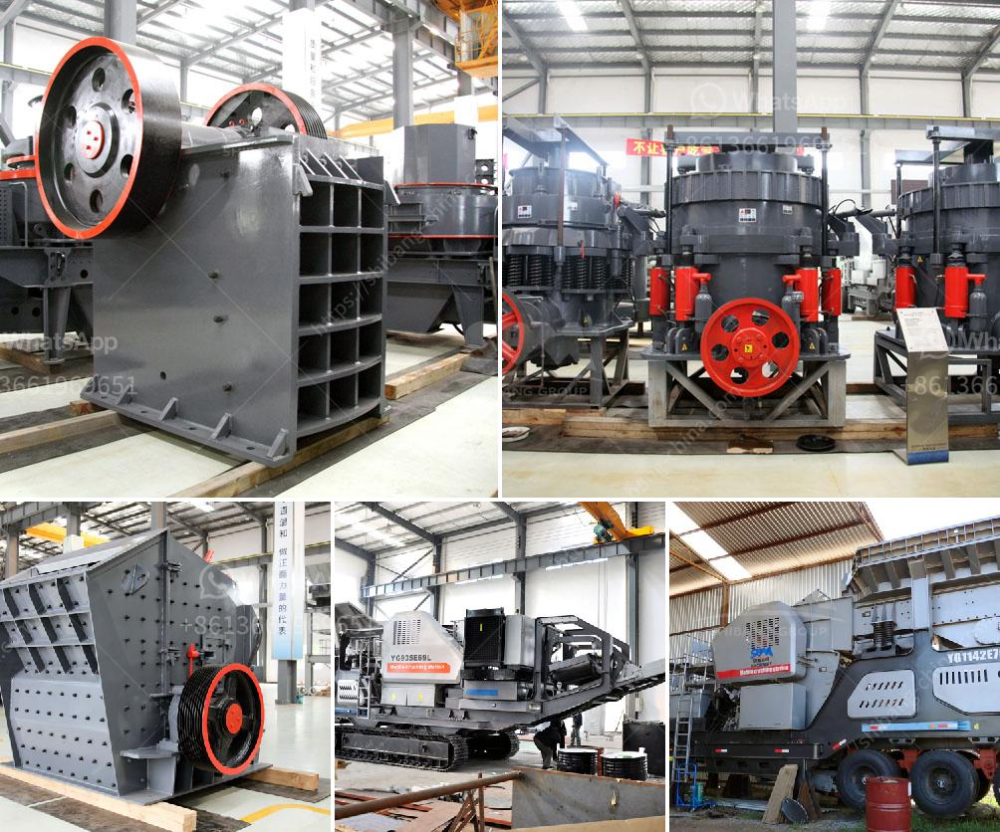

<h3>rock quarry sizing process</h3>
Rock quarries are essential for the construction industry, providing an abundant and durable source of materials for various projects. However, not all rocks are created equal, and their size often determines their utility. The process of sizing rock quarries involves careful analysis and consideration to determine the ideal stone size for specific applications.

The sizing process begins with an initial evaluation of the quarry's geology and composition. Geologists analyze the rock types and quality to identify the most suitable areas for extraction. This study includes an assessment of the deposit's size, shape, and depth to determine the potential yield of usable material.

Once a quarry is deemed suitable for extraction, physical and chemical testing of extracted samples take place. By analyzing the rock's compressive strength, density, and durability, geologists can determine the best use for specific types of rock. This crucial information guides the subsequent sizing process.

The next step involves crushing the extracted rocks into smaller, more manageable sizes. Various machinery, such as crushers and screens, are employed to reduce the size of the rocks. Specific crushing techniques are utilized depending on the desired end-product and the overall project requirements.

After initial crushing, the rocks undergo further screening to segregate them into different size fractions. This process helps in producing consistent stone sizes for different applications. The screens' size openings determine the final product sizes, which could range from fine gravel to larger stones suitable for road construction or building purposes.

During the screening process, several parameters are taken into consideration, such as the angularity, surface texture, and shape of the stones. These factors can significantly influence the stones' performance when used in construction. For instance, rounded stones are often better suited for decorative purposes, while angular ones are preferred for road aggregates due to their improved interlocking properties.

The resulting sizes are then categorized into various product lines tailored to meet specific market demands. Fine aggregates, such as sand, are often utilized for concrete production. Medium-sized stones may be used for drainage systems, while larger stones find usage in base and sub-base layers for road construction.

It is important to note that the quarry sizing process is not a one-size-fits-all approach. Product demand, regional construction specifications, and environmental regulations all play a role in determining the desired stone sizes. Flexibility and adaptability are essential to meet changing market needs and regulatory requirements.

In conclusion, the rock quarry sizing process plays a crucial role in producing stones of ideal sizes for construction purposes. Geologists meticulously study the quarry's geology, while physical and chemical testing help determine the rocks' ultimate uses. Crushing and screening techniques further refine the stones into different size fractions to meet specific market demands. The ability to provide the right-sized stone products ensures the uninterrupted supply of essential material for construction projects worldwide.
<h3>Contact us</h3><ul><li><strong>Whatsapp:&nbsp;<a href="https://wa.me/8613661969651">+8613661969651</a></strong></li><li><a href="https://swt.shibang-china.com/?git&amp;zhl&amp;rock quarry sizing process"><strong>Online Service(chat now)</strong></a></li></ul><h3>Related</h3><ul><li><a href='feldspar grinding machine.md'>feldspar grinding machine</a></li><li><a href='price of hammer mill in nigeria.md'>price of hammer mill in nigeria</a></li><li><a href='priducer prices for stone crusher in usa.md'>priducer prices for stone crusher in usa</a></li><li><a href='production grinding mill europe.md'>production grinding mill europe</a></li><li><a href='standar operasional prosedur batubara mininh.md'>standar operasional prosedur batubara mininh</a></li></ul>