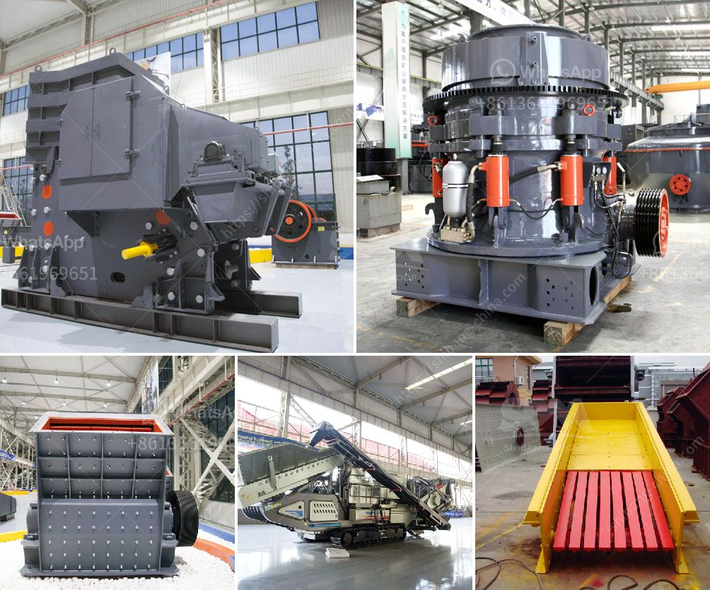

<h3>rock salt processing plant</h3>
Rock salt, also known as halite, is a mineral that is predominantly composed of sodium chloride. It is commonly used in various industries, ranging from food preservation to snow and ice removal. To meet the growing demand for this versatile mineral, rock salt processing plants play a crucial role in ensuring a steady supply.

A rock salt processing plant is a facility where raw rock salt is crushed, washed, and screened to prepare it for various industrial applications. The process begins with the extraction of rock salt from underground deposits or salt mines. These deposits are typically formed from the evaporation of ancient saltwater bodies millions of years ago.

After the extraction, the raw rock salt is transported to the processing plant. The first step in the processing plant is the crushing of the salt rock into smaller, more manageable pieces. This is typically done using heavy-duty machinery such as crushers and jaw crushers. The crushed salt rock is then conveyed to the washing plant.

In the washing plant, the crushed rock salt is mixed with water to dissolve impurities such as mud, clay, and other contaminants. This process is known as brining and involves the use of large tanks where the salt is suspended in water. As the impurities dissolve, they settle at the bottom of the tanks, and the clear brine is extracted from the top.

The next step is the separation of the salt from the brine. The brine is heated under controlled conditions to evaporate the water, leaving behind salt crystals. This process, known as evaporation, is commonly carried out in large evaporator ponds or chambers. The heat source can be solar energy, geothermal energy, or waste heat from other industrial processes.

Once the water is completely evaporated, the salt crystals are harvested and transported for further processing. The crystals are usually washed to remove any remaining impurities and then dried to reduce moisture content. This drying process can be performed using natural sunlight, commercial dryers, or a combination of both.

After drying, the salt crystals are screened to separate them into various grades based on their particle sizes. This is an essential step in ensuring consistent quality and meeting customer requirements. The graded salt is then packaged and dispatched for sale, storage, or further refinement.

In addition to producing table salt and de-icing salt, rock salt processing plants also produce other salt-based products such as salt blocks for livestock, industrial salts for chemical and manufacturing processes, and salt for water treatment plants.

In conclusion, rock salt processing plants are vital for processing raw rock salt into various products that cater to different industries' needs. The process involves crushing, washing, evaporation, drying, and screening to produce high-quality salt crystals. These plants ensure a steady supply of rock salt, supporting industries ranging from food and agriculture to manufacturing and water treatment.
<h3>Contact us</h3><ul><li><strong>Whatsapp:&nbsp;<a href="https://wa.me/8613661969651">+8613661969651</a></strong></li><li><a href="https://swt.shibang-china.com/?git&amp;zhl&amp;rock salt processing plant"><strong>Online Service(chat now)</strong></a></li></ul><h3>Related</h3><ul><li><a href='china manufacturers of sand washing machine.md'>china manufacturers of sand washing machine</a></li><li><a href='jaw crusher shaft parts diagram.md'>jaw crusher shaft parts diagram</a></li><li><a href='granite quarry machinery from turkey.md'>granite quarry machinery from turkey</a></li><li><a href='crusher plant for sale in south africa.md'>crusher plant for sale in south africa</a></li><li><a href='mobile screen machine.md'>mobile screen machine</a></li></ul>