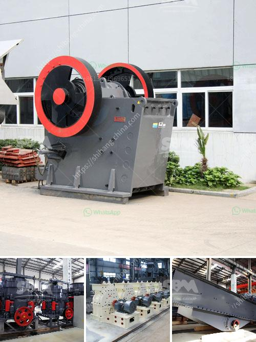

<h3>rock sand making machine</h3>
Rock sand making machine, also known as vertical shaft impact crusher, is usually used to make sand in the final stage of crushing process. Manufactured sand is increasingly used as a substitute for natural sand due to its excellent granular shape and quality.

The raw material is fed into the rock sand making machine from the hopper. Then, it enters the crushing chamber to be impacted, crushed, and ground by the high-speed hammer. The crushed material is thrown onto the impact plate and then bounces back onto the lining plate for further crushing. This process repeats until the material is crushed to the required size and discharged.

1. High efficiency: The rock sand making machine uses the principles of "stone hitting stone" and "stone hitting iron." It not only has high crushing efficiency but also saves energy.

2. Good shape and grain size: The rock sand making machine produces sand with a good particle shape and uniform particle size, which meets the requirements of high-speed railway construction and concrete production.

3. Low maintenance: The wear-resistant parts of the rock sand making machine are made of high-quality alloy materials, which have a long service life and are easy to replace.

4. Adjustable fineness: The rotor speed of the rock sand making machine can be adjusted according to different fineness requirements. The higher the rotor speed, the finer the product size.

5. Environmental protection: The rock sand making machine is equipped with a dust removal device, which can effectively control the dust discharge, reduce environmental pollution, and meet the national environmental protection standards.

1. Construction industry: The manufactured sand produced by the rock sand making machine can be used as a substitute for natural sand in mortar, plastering, concrete, and other construction applications.

2. Highway construction: The excellent particle shape and compact structure of manufactured sand make it an ideal choice for highway construction projects, improving road performance and reducing maintenance costs.

3. Railway construction: The uniform particle size and good shape of manufactured sand can ensure the stability and safety of railway construction projects. It is widely used in railway ballast and roadbed materials.

4. Concrete production: Manufactured sand produced by the rock sand making machine can be used as fine aggregate in concrete. It improves the workability of concrete, reduces water consumption, and enhances the strength and durability of concrete.

In conclusion, rock sand making machine plays a crucial role in producing high-quality manufactured sand. With its ability to crush and shape the stone, the final product from the rock sand making machine is of high quality, making it an essential equipment in the construction industry.
<h3>Contact us</h3><ul><li><strong>Whatsapp:&nbsp;<a href="https://wa.me/8613661969651">+8613661969651</a></strong></li><li><a href="https://swt.shibang-china.com/?git&amp;zhl&amp;rock sand making machine"><strong>Online Service(chat now)</strong></a></li></ul><h3>Related</h3><ul><li><a href='coal crusher supplier.md'>coal crusher supplier</a></li><li><a href='ball india ball mills 220 tph.md'>ball india ball mills 220 tph</a></li><li><a href='cara menghitung kapasitas pada belt conveyor.md'>cara menghitung kapasitas pada belt conveyor</a></li><li><a href='japan granite machine.md'>japan granite machine</a></li><li><a href='gypsum board making machine price in india.md'>gypsum board making machine price in india</a></li></ul>