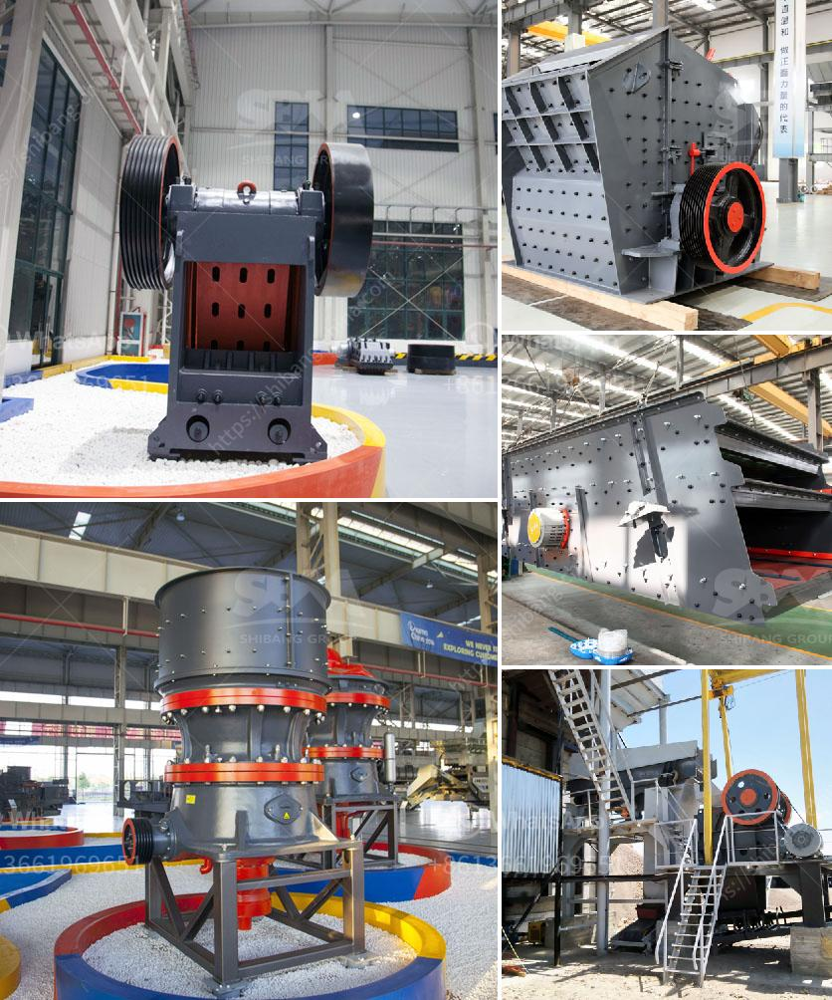

<h3>rock stone milling machine</h3>
Rock stone milling machines are powerful tools used for cutting, shaping, and finishing hard materials like granite, limestone, and marble. With their robust design and advanced features, these machines have revolutionized the stone industry, making the process of stone fabrication more efficient and precise.

One of the key advantages of rock stone milling machines is their ability to cut through hard materials with ease. Traditional methods of cutting stone, such as using a chisel and hammer, are time-consuming and labor-intensive. With the advent of milling machines, craftsmen can now achieve accurate cuts in a fraction of the time, saving both time and effort. This makes them an invaluable tool for stone fabricators and construction companies dealing with large-scale stone projects.

Another significant advantage of rock stone milling machines is their versatility. These machines are equipped with different types of cutting tools, such as diamond saw blades, drills, and routers, which allow for a variety of cuts and shapes to be made. Whether it's creating simple slabs or intricate designs, these machines can handle a wide range of stone cutting tasks, providing unparalleled precision and quality.

In addition to cutting, rock stone milling machines can also be used for shaping and finishing stone surfaces. The machines come with rotary bits and grinding wheels that can be used to shape and polish the edges and surfaces of stones. This capability allows for the creation of smooth and seamless finishes, enhancing the aesthetic appeal of the final stone products.

One of the standout features of modern rock stone milling machines is their computer numerical control (CNC) capabilities. CNC technology allows for automated and precise stone cutting, shaping, and finishing. By programming the desired specifications into the machine's control panel, craftsmen can achieve consistent and accurate results, ensuring that each stone product meets the necessary specifications.

Furthermore, the advanced features of rock stone milling machines also contribute to improved safety and efficiency. Most machines are equipped with safety features like emergency stop buttons and protective covers, minimizing the risks associated with stone fabrication. Additionally, the fast and efficient cutting process reduces material wastage, maximizing productivity and cost-effectiveness.

The use of rock stone milling machines has undoubtedly transformed the stone industry, providing stone fabricators and construction companies with a highly efficient and versatile tool. These machines not only save time and effort but also produce superior-quality stone products. The ability to achieve accurate cuts, shapes, and finishes with CNC precision has revolutionized the way stones are fabricated, making it easier for craftsmen to bring their creative designs to life. With the continuous advancements in technology, rock stone milling machines are bound to become even more advanced, further streamlining the stone fabrication process and pushing the boundaries of what is possible in stone craftsmanship.
<h3>Contact us</h3><ul><li><strong>Whatsapp:&nbsp;<a href="https://wa.me/8613661969651">+8613661969651</a></strong></li><li><a href="https://swt.shibang-china.com/?git&amp;zhl&amp;rock stone milling machine"><strong>Online Service(chat now)</strong></a></li></ul><h3>Related</h3><ul><li><a href='mtm 160 mill spare parts suppliers in india.md'>mtm 160 mill spare parts suppliers in india</a></li><li><a href='small scale pulverizing ball mill.md'>small scale pulverizing ball mill</a></li><li><a href='limestone production mining equipment for sale.md'>limestone production mining equipment for sale</a></li><li><a href='gypsum factory in pakistan.md'>gypsum factory in pakistan</a></li><li><a href='ball mill for 15tphr capacity.md'>ball mill for 15tphr capacity</a></li></ul>