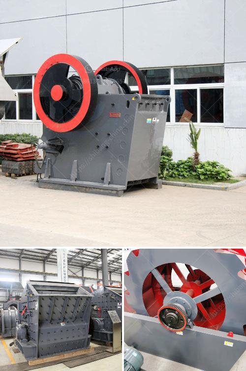

<h3>rock stone zambia mining crushing plants</h3>
Rockstone Zambia Limited is a leading mining company in Zambia that focuses on extracting and processing a variety of quality rock materials. The company has been in operation for over a decade and has established itself as a reliable supplier of crushed stones and quarry dust. With a range of crushing plants operating across various locations in the country, Rockstone Zambia provides high-quality materials to meet the diverse needs of the local construction and mining industry.

One of the key aspects that sets Rockstone Zambia apart from other mining companies is their commitment to sustainable mining practices. The company adheres to strict environmental regulations and invests in technologies that minimize the impact of their operations on the surrounding ecosystem. This includes implementing dust control measures, recycling water used in the crushing process, and restoring mined areas to their natural state once the extraction is complete.

Rockstone Zambia operates a fleet of mobile crushing plants that can be easily transported to various sites across the country. These plants are equipped with advanced crushing equipment that enables efficient and precise crushing of rocks into desired sizes. The company's crushing plants have a production capacity that ranges from 50 to 500 tons per hour, ensuring a steady supply of materials for construction projects of any scale.

The quality of Rockstone Zambia's crushed stones is another reason why they are the preferred supplier for many contractors and developers in the country. The company has invested in state-of-the-art crushing technology that ensures the production of consistently high-grade materials. The aggregates produced by Rockstone Zambia's crushing plants meet the required specifications for various construction applications, including road construction, building foundations, and concrete production.

Additionally, Rockstone Zambia offers a wide range of rock products to cater to the specific needs of their customers. These include quarry dust, crushed concrete, and various sizes of stones, all of which are produced under strict quality control measures. The company's dedicated team of experts ensures that every batch of material is thoroughly tested to meet the highest quality standards.

Another notable aspect of Rockstone Zambia's operations is their commitment to safety. The company prioritizes the well-being of their workforce and follows strict safety protocols to prevent accidents and injuries. Continuous training and regular safety inspections are carried out to promote a culture of safety at all levels of the organization.

In conclusion, Rockstone Zambia Limited is a reputable mining company that specializes in extracting and processing high-quality rock materials. Through their fleet of mobile crushing plants, the company provides a reliable supply of crushed stones and aggregates for various construction projects in Zambia. With a focus on sustainable mining practices, adherence to strict environmental regulations, and a commitment to safety, Rockstone Zambia sets a benchmark for responsible mining and continues to contribute to the growth and development of the local construction industry.
<h3>Contact us</h3><ul><li><strong>Whatsapp:&nbsp;<a href="https://wa.me/8613661969651">+8613661969651</a></strong></li><li><a href="https://swt.shibang-china.com/?git&amp;zhl&amp;rock stone zambia mining crushing plants"><strong>Online Service(chat now)</strong></a></li></ul><h3>Related</h3><ul><li><a href='marchine stone crusher cost in kenya.md'>marchine stone crusher cost in kenya</a></li><li><a href='bauxite ore processing equipment price.md'>bauxite ore processing equipment price</a></li><li><a href='manganese ball milling machine.md'>manganese ball milling machine</a></li><li><a href='used stone crushers dealer.md'>used stone crushers dealer</a></li><li><a href='crusher stone price bolivia.md'>crusher stone price bolivia</a></li></ul>