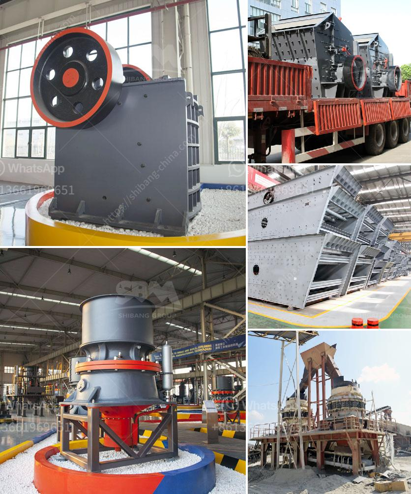

<h3>rod mill for sale perth</h3>
Are you in the market for a top-quality rod mill? Look no further than Perth! With its booming mining and construction industries, Perth is the perfect place to find a rod mill for sale. These powerful machines are essential for processing and grinding materials into fine particles, making them a must-have for any industry that works with minerals or other raw materials.

Perth is known for its strong mining sector, with numerous mines and mineral processing plants located nearby. This high demand for minerals has created a thriving market for rod mills, as they are essential for extracting valuable minerals from rocks and ores. In addition to mining, Perth also has a vibrant construction industry, which relies on rod mills for producing construction materials such as cement and concrete.

One of the key advantages of purchasing a rod mill in Perth is the wide range of options available. Perth is home to many reputable equipment manufacturers and suppliers who offer various types and sizes of rod mills to suit different industries and requirements. Whether you need a small rod mill for a small-scale operation or a large-scale one for heavy-duty processing, you can find the perfect machine in Perth.

Not only does Perth offer a diverse range of rod mills, but it also provides competitive prices. The presence of multiple manufacturers and suppliers in the region fosters healthy competition, driving prices down and ensuring that buyers get the best value for their money. With a little research and comparison, you can easily find a rod mill that fits your budget without compromising on quality or performance.

Another advantage of purchasing a rod mill in Perth is the ease of access to after-sales services and spare parts. Local manufacturers and suppliers often have service centers and warehouses in the area, making it convenient for customers to get the necessary support and spare parts when needed. This ensures minimal downtime and maximizes the productivity of your rod mill.

When buying a rod mill in Perth, it is essential to consider the reputation and experience of the manufacturer or supplier. Look for companies that have a proven track record in producing high-quality and reliable machines. Reading customer reviews and testimonials can give you valuable insights into the reputation and customer satisfaction of different companies.

To find a rod mill for sale in Perth, you can start by searching online for manufacturers and suppliers in the area. Take the time to browse through their websites, explore their product offerings, and compare prices. If possible, visit their showrooms or arrange for a consultation to see the machines in person and discuss your requirements.

In conclusion, if you are looking for a rod mill for sale, Perth is the place to be. With its thriving mining and construction industries, wide range of options, competitive prices, and convenient access to after-sales services, Perth offers everything you need to find the perfect rod mill for your business. Start your search today and take your operations to the next level with a top-quality rod mill from Perth!
<h3>Contact us</h3><ul><li><strong>Whatsapp:&nbsp;<a href="https://wa.me/8613661969651">+8613661969651</a></strong></li><li><a href="https://swt.shibang-china.com/?git&amp;zhl&amp;rod mill for sale perth"><strong>Online Service(chat now)</strong></a></li></ul><h3>Related</h3><ul><li><a href='harga stone crusher 400 x 600 harga stone crusher.md'>harga stone crusher 400 x 600 harga stone crusher</a></li><li><a href='which way should the ball mill rotate.md'>which way should the ball mill rotate</a></li><li><a href='how much a stone crusher cost.md'>how much a stone crusher cost</a></li><li><a href='used crushing plants for sale in uae.md'>used crushing plants for sale in uae</a></li><li><a href='crushing plant turkey.md'>crushing plant turkey</a></li></ul>