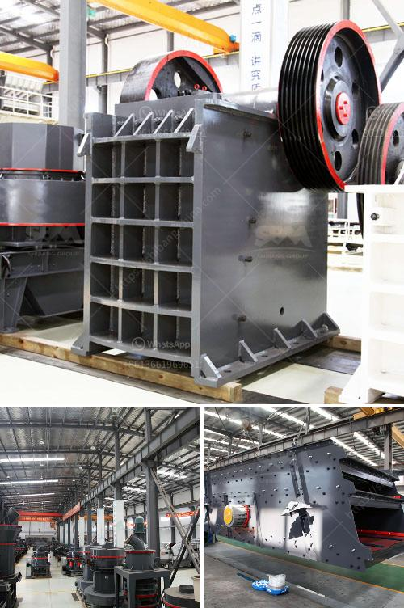

<h3>rodillos para trituradoras en bogota</h3>
En la industria del reciclaje de materiales, las trituradoras juegan un papel fundamental al reducir el tamaño de los residuos y convertirlos en material reutilizable. Una de las piezas clave en estas máquinas son los rodillos para trituradoras, componentes fundamentales que permiten asegurar un rendimiento óptimo y eficiente en el proceso de trituración.

En Bogotá, una ciudad en constante crecimiento y desarrollo, el manejo adecuado de los residuos se ha convertido en un desafío importante. Las trituradoras son utilizadas tanto en empresas especializadas en reciclaje como en obras de construcción y demolición, para procesar materiales como plástico, madera, vidrio, concreto y escombros, entre otros.

Los rodillos para trituradoras en Bogotá, son fabricados en talleres especializados con tecnología de vanguardia. Estos rodillos están diseñados para soportar altas cargas de trabajo y resistir el desgaste generado por el proceso de trituración. Dependiendo del tipo de material a triturar y el tamaño de la trituradora, los rodillos pueden tener diferentes formas y tamaños.

Una de las ventajas de utilizar rodillos para trituradoras de alta calidad es que optimizan la eficiencia del proceso de trituración, permitiendo una mayor producción de material reciclado en menor tiempo. Además, ayudan a reducir la vibración y el ruido generados durante la trituración, mejorando así las condiciones de trabajo de los operarios.

En Bogotá, existen varias empresas que se dedican a la fabricación y venta de rodillos para trituradoras. Estas empresas ofrecen una amplia gama de rodillos de calidad, fabricados con materiales resistentes y duraderos como el acero al manganeso. Estos rodillos se ajustan a los estándares internacionales y son sometidos a pruebas exhaustivas para garantizar su eficiencia y resistencia.

Además, estas empresas también ofrecen servicios de mantenimiento y reparación de los rodillos para trituradoras, lo que permite prolongar su vida útil y minimizar los tiempos de inactividad de las máquinas. Este servicio es esencial para garantizar un funcionamiento óptimo de las trituradoras y evitar pérdidas económicas ocasionadas por fallas en los componentes.

Cuando se trata de adquirir rodillos para trituradoras en Bogotá, es importante contar con asesoramiento técnico especializado. Cada máquina de trituración tiene sus propias especificaciones y requerimientos, y es necesario elegir los rodillos adecuados para asegurar un rendimiento óptimo y prolongar la vida útil de la máquina.

En resumen, los rodillos para trituradoras desempeñan un papel esencial en el proceso de reciclaje de materiales en Bogotá. Estos componentes permiten optimizar la eficiencia de las máquinas trituradoras, aumentando la producción de material reciclado en menor tiempo. Además, la calidad y resistencia de los rodillos contribuyen a garantizar la seguridad y bienestar de los trabajadores. Por lo tanto, es fundamental elegir rodillos de alta calidad y contar con servicios técnicos especializados para mantener y reparar estos componentes.
<h3>Contact us</h3><ul><li><strong>Whatsapp:&nbsp;<a href="https://wa.me/8613661969651">+8613661969651</a></strong></li><li><a href="https://swt.shibang-china.com/?git&amp;zhl&amp;rodillos para trituradoras en bogota"><strong>Online Service(chat now)</strong></a></li></ul><h3>Related</h3><ul><li><a href='quarry crushing machine.md'>quarry crushing machine</a></li><li><a href='calcium grinding mill.md'>calcium grinding mill</a></li><li><a href='gold crushing machine price in usa.md'>gold crushing machine price in usa</a></li><li><a href='top 20 coal mining companies in indonesia.md'>top 20 coal mining companies in indonesia</a></li><li><a href='crusher 300 sampai 400 ton dan hr dijual.md'>crusher 300 sampai 400 ton dan hr dijual</a></li></ul>