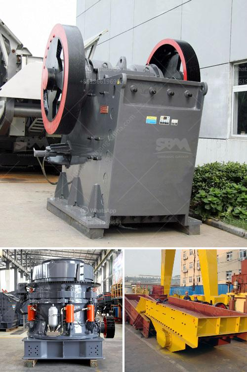

<h3>roll crusher kenya</h3>
Roll crushers are used in the mining industry to crush large rocks and stones into smaller pieces. They help to reduce the size of materials for further processing, such as in the production of cement or other building materials. One country where roll crushers are widely utilized is Kenya.

Kenya is located in East Africa and is known for its diverse landscapes, including mountains, lakes, and wildlife reserves. The country has a thriving mining industry, which plays a significant role in its economy. Roll crushers are commonly used in Kenya's mining industry to break down larger rocks and stones into smaller pieces.

The use of roll crushers in Kenya offers several advantages. Firstly, these crushers are highly efficient and can produce a high reduction ratio, making them ideal for processing materials with a high compressive strength. They can easily break down rocks and stones into smaller sizes, which can be used for various purposes in different industries.

Secondly, roll crushers in Kenya are versatile machines that can be used for a wide range of applications. They can crush a variety of materials, including limestone, coal, and clay. This makes them suitable for use in the production of cement, as well as other construction materials.

Another advantage of using roll crushers in Kenya is their low operating costs. These crushers require minimal maintenance and are built to withstand harsh conditions. They are designed to deliver consistent and reliable performance, even in demanding mining environments.

In conclusion, roll crushers are widely used in Kenya's mining industry due to their efficiency, versatility, and low operating costs. They help to break down larger rocks and stones into smaller pieces, which can be used for various purposes in different industries. As Kenya continues to develop its mining sector, the use of roll crushers is expected to increase further, contributing to the country's economic growth.
<h3>Contact us</h3><ul><li><strong>Whatsapp:&nbsp;<a href="https://wa.me/8613661969651">+8613661969651</a></strong></li><li><a href="https://swt.shibang-china.com/?git&amp;zhl&amp;roll crusher kenya"><strong>Online Service(chat now)</strong></a></li></ul><h3>Related</h3><ul><li><a href='iron ore production from chrysotile.md'>iron ore production from chrysotile</a></li><li><a href='bauxite processing plant kenya.md'>bauxite processing plant kenya</a></li><li><a href='gypsum processing crusher.md'>gypsum processing crusher</a></li><li><a href='gold wash plant turkey manufacturer.md'>gold wash plant turkey manufacturer</a></li><li><a href='manganese ball milling machine.md'>manganese ball milling machine</a></li></ul>