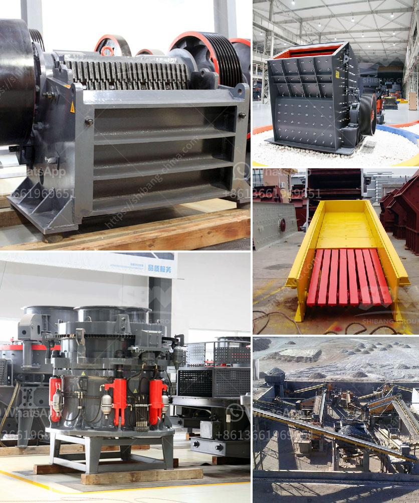

<h3>roll crusher price</h3>
A roll crusher is a piece of heavy-duty equipment used in mining and industrial processes. It features a pair of large wheels or cylinders mounted on horizontal axes. When rocks, ore, and other materials pass between the two cylinders, they are crushed or refined into smaller particles. This machine is popular in industries such as mining, construction, and recycling, where materials need to be processed efficiently.

If your business requires a roll crusher, it's crucial to understand the factors that influence its price. In this article, we will discuss the key considerations and options available in the market.

One of the primary determinants of the roll crusher price is its size and capacity. Roll crushers are available in a variety of sizes, ranging from single-roll units to large machines with multiple rolls. The size and capacity will influence the amount of material the crusher can handle and the final product size required. Generally, larger roll crushers with higher capacity are more expensive.

Another factor affecting the price is the manufacturing brand. Well-established brands with a reputation for high-quality products are likely to charge a premium compared to lesser-known brands. While it may be tempting to opt for a cheaper, lesser-known brand, it's crucial to consider the long-term durability, warranty, and availability of spare parts. Investing in a reputable brand may save you money in the long run by reducing maintenance and downtime costs.

The machine's specifications and additional features also impact the price. Some roll crushers come with additional components such as feed hoppers, screens, or conveyor belts, enabling a complete crushing and screening process. These extra features add value but also increase the price. It's essential to evaluate whether these additional features align with your specific operational needs and justify the increased cost.

Moreover, the condition of the used roll crusher can significantly affect its price. While brand new machines may be more expensive, they offer the advantage of peak performance and come with a warranty. On the other hand, used crushers are typically cheaper, but their condition and potential repair costs should be carefully evaluated. It's advisable to consult an expert or conduct a thorough inspection before purchasing a used roll crusher.

Lastly, market demand and competition can influence the price of roll crushers. If there is high demand and limited supply of roll crushers, the prices are likely to rise. However, if there is intense competition between manufacturers, prices may be more competitive. It's always recommended to compare prices from different suppliers to ensure you're getting the best deal.

In conclusion, the price of a roll crusher is influenced by various factors, including size, capacity, brand, specifications, condition, and market demand. To make an informed decision, it's essential to consider your specific requirements, long-term maintenance costs, and the reputation of the manufacturer. By conducting thorough research and comparing prices, you can find a roll crusher that meets your needs without breaking the bank.
<h3>Contact us</h3><ul><li><strong>Whatsapp:&nbsp;<a href="https://wa.me/8613661969651">+8613661969651</a></strong></li><li><a href="https://swt.shibang-china.com/?git&amp;zhl&amp;roll crusher price"><strong>Online Service(chat now)</strong></a></li></ul><h3>Related</h3><ul><li><a href='equipment necessary to exploiting a quarry.md'>equipment necessary to exploiting a quarry</a></li><li><a href='concrete crusher machine for sale.md'>concrete crusher machine for sale</a></li><li><a href='coal crusher supplier.md'>coal crusher supplier</a></li><li><a href='rock crusher china.md'>rock crusher china</a></li><li><a href='ball mills for mining in china.md'>ball mills for mining in china</a></li></ul>