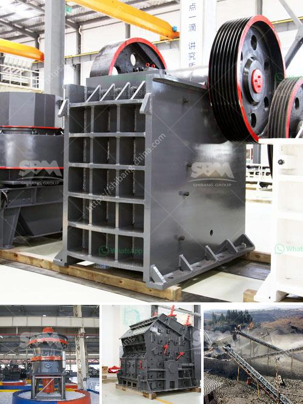

<h3>roll mills supplier in karachi</h3>
Karachi, the bustling industrial hub of Pakistan, is known for its diverse manufacturing sectors. From textiles to petrochemicals, the city houses numerous industries that contribute significantly to the country's economy. Amongst the key players in this thriving industrial landscape are roll mills suppliers. Roll mills are integral to the production processes of various industries, such as rubber, plastic, and paper.

Roll mills, also known as rolling mills, are machines used to shape and reduce the thickness of materials such as metals, plastics, and rubber. These machines consist of a pair of cylindrical rollers that rotate in opposite directions, exerting a controlled amount of pressure on the material between them. The primary purpose of roll mills is to homogeneously blend and refine raw materials, ensuring quality output in manufacturing processes.

Karachi, being the industrial backbone of Pakistan, requires reliable and technologically advanced roll mills to cater to its diverse manufacturing sectors. Hence, there are several roll mills suppliers in the city, offering an extensive range of equipment and services. These suppliers play a crucial role in enhancing industrial production and meeting the growing demands of various industries.

One prominent roll mills supplier in Karachi is XYZ Industries. With over three decades of experience in the field, XYZ Industries has established a formidable reputation for providing high-quality roll mills and exceptional customer service. They offer a wide range of roll mills, including lab-scale mills for research and development purposes, as well as larger-scale mills for industrial production.

XYZ Industries prides itself on its commitment to innovation and advanced technology. They regularly invest in research and development to ensure their roll mills stay at the forefront of industry standards. By incorporating state-of-the-art features and mechanisms, XYZ Industries enables its customers to achieve greater efficiency and production output. This commitment to innovation has made XYZ Industries a preferred choice for various manufacturing sectors in Karachi.

The roll mills supplied by XYZ Industries are known for their robust construction, durability, and precision. These machines are engineered to handle demanding manufacturing processes while ensuring consistent quality. Additionally, XYZ Industries offers comprehensive after-sales support, including maintenance, repair, and spare parts services. This ensures that their customers' production lines remain operational and minimize downtime.

Another key roll mills supplier in Karachi is ABC Manufacturing. With a focus on providing affordable yet reliable equipment, ABC Manufacturing caters to small and medium-sized industries in the city. They offer a range of roll mills suited to different budgets and production requirements. The company prides itself on its quick response time, efficient delivery, and personalized customer service, making it a trusted choice for local manufacturers.

In conclusion, roll mills suppliers in Karachi play a vital role in the city's industrial landscape. These suppliers provide essential equipment and services to various manufacturing sectors, enhancing production efficiency and quality. Companies like XYZ Industries and ABC Manufacturing not only provide technologically advanced roll mills but also prioritize customer satisfaction through their after-sales support. With such reliable suppliers, the industrial production in Karachi continues to thrive, contributing to the overall growth of Pakistan's economy.
<h3>Contact us</h3><ul><li><strong>Whatsapp:&nbsp;<a href="https://wa.me/8613661969651">+8613661969651</a></strong></li><li><a href="https://swt.shibang-china.com/?git&amp;zhl&amp;roll mills supplier in karachi"><strong>Online Service(chat now)</strong></a></li></ul><h3>Related</h3><ul><li><a href='ball grinder machine.md'>ball grinder machine</a></li><li><a href='bauxite plant in dubai.md'>bauxite plant in dubai</a></li><li><a href='mineral processing calculations pdf.md'>mineral processing calculations pdf</a></li><li><a href='beneficiation process of clay.md'>beneficiation process of clay</a></li><li><a href='raymond mill for.md'>raymond mill for</a></li></ul>