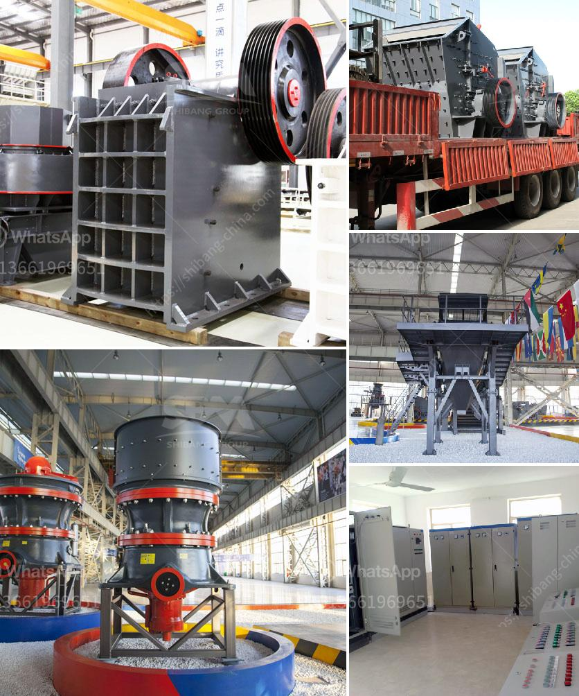

<h3>roller crusher company</h3>
When it comes to crushing materials, there are few machines that do it better than roller crushers. Specifically designed to handle brittle materials, these machines are perfect for crushing materials such as clinker, coal, sintered bauxite, and more. However, roller crushers alone can be overwhelming for certain applications. That’s where roller crusher companies come in, providing comprehensive crushing solutions to meet the specific needs of various industries.

One such company specializing in roller crushers is XYZ Roller Crusher Company. With years of experience in the industry, they have developed a strong reputation for providing high-quality, reliable equipment that delivers outstanding performance. Whether it's for cement plants, power plants, mining operations, or any other industry, XYZ Roller Crusher Company has the expertise and products to meet the crushing needs of their clients.

The key to the success of XYZ Roller Crusher Company lies in their commitment to innovation and advanced engineering. They understand that every client has unique requirements, which is why they offer a wide range of roller crusher models with different specifications. This ensures that clients can find the right roller crusher to suit their specific application and material characteristics.

One of the standout features of XYZ roller crushers is their durability and robust construction. Made from high-quality materials and employing the latest manufacturing techniques, these crushers are built to withstand heavy-duty use and provide long-lasting performance. Additionally, XYZ Roller Crusher Company focuses on easy maintenance and servicing to minimize downtime and increase productivity.

In addition to their exceptional products, XYZ Roller Crusher Company prides itself on offering excellent customer service. Their team of knowledgeable and experienced professionals is always available to provide guidance and support throughout the entire process. From the initial consultation to the installation and ongoing maintenance, XYZ Roller Crusher Company ensures a seamless experience for their clients.

Furthermore, XYZ Roller Crusher Company recognizes the importance of environmental responsibility. Their machines are designed to minimize dust emissions and noise pollution, making them a more sustainable choice for crushing operations. This commitment to eco-friendly practices aligns with the growing demand for greener solutions across various industries.

In conclusion, XYZ Roller Crusher Company is a reputable provider of high-quality roller crushers and comprehensive crushing solutions. With their wide range of products, advanced engineering, and commitment to client satisfaction, they have established themselves as a leader in the industry. Whether it's for cement plants, mining, or power generation, XYZ Roller Crusher Company provides innovative, durable, and efficient crushing equipment to meet the diverse needs of their clients.
<h3>Contact us</h3><ul><li><strong>Whatsapp:&nbsp;<a href="https://wa.me/8613661969651">+8613661969651</a></strong></li><li><a href="https://swt.shibang-china.com/?git&amp;zhl&amp;roller crusher company"><strong>Online Service(chat now)</strong></a></li></ul><h3>Related</h3><ul><li><a href='hammer mill in malaysia.md'>hammer mill in malaysia</a></li><li><a href='crushing plants suppliers sales in nigeria.md'>crushing plants suppliers sales in nigeria</a></li><li><a href='ore wash plant for sale.md'>ore wash plant for sale</a></li><li><a href='beneficios de una chancadora conica.md'>beneficios de una chancadora conica</a></li><li><a href='capacity of hammer mills used in kenya.md'>capacity of hammer mills used in kenya</a></li></ul>