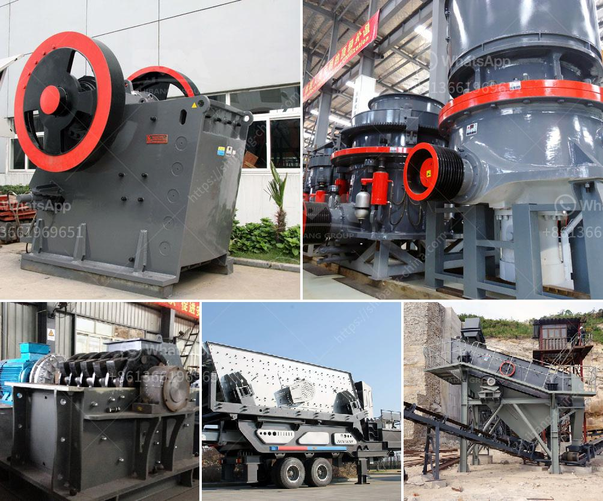

<h3>roller for plate mill manufacturer</h3>
Plate mills are critical equipment in the metalworking industry, used for shaping and forming metal plates into desired sizes and shapes. One crucial component of plate mills is the roller, which plays a significant role in ensuring efficient and precise plate rolling. As a leading plate mill manufacturer, we understand the importance of high-quality rollers in achieving optimal performance and delivering exceptional results.

The roller is responsible for exerting pressure on the metal plates, facilitating their deformation and reshaping. It must be durable enough to withstand the substantial forces involved in plate rolling while accurately maintaining the desired dimensions and tolerances. Our rollers are manufactured using advanced materials and cutting-edge technology to ensure their strength, reliability, and longevity.

Precise plate rolling requires rollers with superior surface quality, as even the slightest imperfections can affect the accuracy of the rolled plates. Our rollers undergo rigorous quality control processes to guarantee a smooth and flawless surface finish. This enables them to deliver precise and uniform pressure distribution across the metal plates, ensuring consistent results throughout the rolling process.

Efficiency is a key requirement in plate mills, as maximizing productivity and minimizing downtime can significantly impact profitability. Our rollers are designed to optimize mill performance, with features such as lower friction and enhanced heat dissipation. By reducing energy consumption and minimizing wear and tear, our rollers increase the overall efficiency of the plate mill operation, resulting in cost savings and improved productivity.

Our roller designs are highly customizable, tailored to meet the specific requirements and preferences of plate mill operators. We offer a wide range of sizes, materials, and surface treatments to ensure compatibility with various plate grades and rolling conditions. Whether it's stainless steel, aluminum, or carbon steel plates, our rollers provide optimal performance and outstanding longevity.

In conclusion, as a plate mill manufacturer, we recognize the critical role of rollers in ensuring efficient and precise plate rolling. Our high-quality rollers are designed to withstand the rigorous demands of plate mill operations, delivering exceptional performance, accuracy, and durability. By choosing our rollers, plate mill operators can achieve optimal efficiency, productivity, and profitability while meeting the highest quality standards in the industry.
<h3>Contact us</h3><ul><li><strong>Whatsapp:&nbsp;<a href="https://wa.me/8613661969651">+8613661969651</a></strong></li><li><a href="https://swt.shibang-china.com/?git&amp;zhl&amp;roller for plate mill manufacturer"><strong>Online Service(chat now)</strong></a></li></ul><h3>Related</h3><ul><li><a href='cost of starting a quarry business.md'>cost of starting a quarry business</a></li><li><a href='rock crusher gravel production.md'>rock crusher gravel production</a></li><li><a href='vertical shaft impact crusher design.md'>vertical shaft impact crusher design</a></li><li><a href='crushing and screening for sale.md'>crushing and screening for sale</a></li><li><a href='equipment of ball mill.md'>equipment of ball mill</a></li></ul>