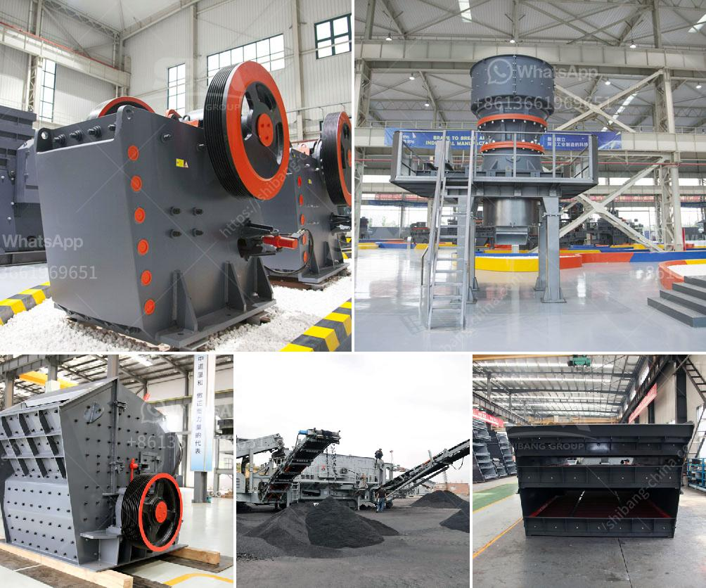

<h3>roller mill for muradabad</h3>
Muradabad, a bustling city in Uttar Pradesh, India, has long been renowned for its rich history and cultural heritage. From brassware to dairy products, the city is known for its diverse range of industries. One such industry, which has seen significant growth and transformation, is the flour milling industry. With the advent of modern technology, especially roller mills, Muradabad's flour industry has witnessed a revolution in terms of quality, efficiency, and overall productivity.

The roller mill, also known as a grain roller mill, is a type of machine that utilizes multiple cylindrical rollers to grind and separate grains into smaller, more refined particles. This ingenious invention has proven to be a game-changer in the flour milling process. It not only improves the quality of the final product but also offers numerous benefits to the mill owners and workers, as well as the end consumers.

One of the primary advantages of using a roller mill in Muradabad's flour industry is increased efficiency. Compared to traditional stone mills, roller mills offer a significantly higher milling capacity. This means that more grain can be processed in a shorter period, resulting in increased productivity and profitability for mill owners. Moreover, roller mills require less manual labor, which reduces the reliance on human resources and allows for more streamlined operations.

Another notable benefit of roller mills is the improved quality of the flour produced. The cylindrical rollers crush the grains more uniformly, ensuring a consistent particle size distribution. This results in a finer, more refined flour with a higher nutritional value. Roller mills also have the ability to separate different parts of the grain more effectively, allowing millers to produce various types of flour, such as whole wheat flour, white flour, and semolina.

Furthermore, roller mills help to minimize wastage in the milling process. Stone mills, due to their grinding mechanism, often produce a substantial amount of flour dust and by-products. Roller mills, on the other hand, have efficient extraction systems that collect and separate the fine dust particles, ensuring minimal loss of valuable flour. This not only reduces wastage but also promotes a cleaner working environment for the mill workers.

In terms of maintenance and durability, roller mills have proven to be highly reliable machines. They are designed to withstand heavy usage and require minimal upkeep. With regular inspections and routine maintenance, roller mills can last for many years without significant wear and tear. This is a significant advantage for mill owners, as it reduces the need for costly repairs and replacements.

The adoption of roller mills in Muradabad's flour industry has brought about a notable positive impact on both the mill owners and the end consumers. The mill owners benefit from increased production capacity, improved flour quality, and reduced operational costs. On the other hand, consumers can enjoy a wider range of high-quality flour products, which are not only nutritionally superior but also ensure a consistent taste in their culinary creations.

In conclusion, the roller mill has undeniably transformed the flour milling industry in Muradabad. As a modern solution, it has ushered in a new era of efficiency, quality, and innovation. With its numerous benefits, including increased productivity, improved flour quality, and reduced wastage, roller mills have become an integral part of the city's thriving flour industry. As the industry continues to flourish, roller mills will undoubtedly play an even more significant role, consolidating Muradabad's position as a major player in India's milling sector.
<h3>Contact us</h3><ul><li><strong>Whatsapp:&nbsp;<a href="https://wa.me/8613661969651">+8613661969651</a></strong></li><li><a href="https://swt.shibang-china.com/?git&amp;zhl&amp;roller mill for muradabad"><strong>Online Service(chat now)</strong></a></li></ul><h3>Related</h3><ul><li><a href='industrial impact crushers.md'>industrial impact crushers</a></li><li><a href='ball mill plant manufacturers.md'>ball mill plant manufacturers</a></li><li><a href='german made stone crushers.md'>german made stone crushers</a></li><li><a href='what is the hammer mill.md'>what is the hammer mill</a></li><li><a href='sand and gravel wash plants usa.md'>sand and gravel wash plants usa</a></li></ul>