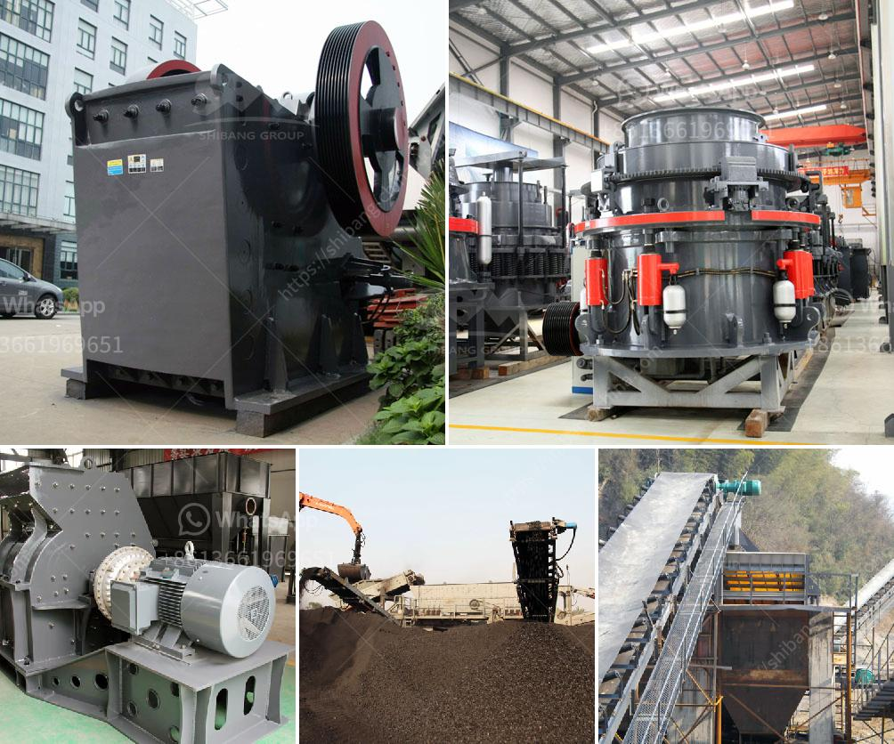

<h3>roller mill malaysia</h3>
Roller mills have long been used in various industries to process raw materials into fine powders. One country that has seen a significant increase in roller mill usage is Malaysia. With its flourishing industrial sector, the demand for roller mills in Malaysia has been on the rise.

A roller mill is a type of machine that utilizes cylindrical rollers to crush and grind material. Its compact design, efficient performance, and ability to produce finely ground products have made it an essential tool in Malaysia's manufacturing industry. Roller mills are commonly used in industries such as food processing, mining, pharmaceuticals, agriculture, and more.

One of the primary reasons why roller mills are popular in Malaysia is their ability to process different types of raw materials. Whether it's grains, minerals, or chemicals, roller mills can grind them effectively. This versatility allows businesses in Malaysia to diversify their operations and cater to a wide range of industries.

The functionality of roller mills is another advantage that makes them indispensable in Malaysia. These machines are designed to pulverize the raw material through a combination of crushing, grinding, and impacting. The resulting powders are uniformly sized and suitable for further processing or packaging. With roller mills, businesses in Malaysia can achieve consistent product quality, which is crucial for meeting market demands.

Energy efficiency is a growing concern for industries worldwide, and roller mills excel in this area. Compared to traditional milling methods, roller mills consume less energy while delivering the same or even better results. This feature not only contributes to cost savings but also helps businesses in Malaysia minimize their carbon footprint, promoting sustainable practices.

In Malaysia, roller mills are widely used in the food processing industry. Whether it's grinding wheat into flour or producing spices, roller mills ensure that the final product is of high quality and safe for consumption. The ability to finely grind food ingredients gives businesses in Malaysia a competitive edge, as they can produce superior products that meet consumers' expectations.

The mining industry in Malaysia also benefits from roller mills. These machines can crush ore into fine particles, allowing for more efficient extraction of minerals. Roller mills are particularly useful in separating valuable minerals from ore, as the crushed particles can be easily separated using other methods. With roller mills, mining operations in Malaysia can streamline their processes and increase productivity.

Another industry that relies on roller mills in Malaysia is the pharmaceutical sector. Roller mills are used to grind medicinal substances into fine powders, which can then be used in the manufacturing of drugs and pharmaceutical formulations. The precision and consistency offered by roller mills make them ideal for producing pharmaceutical-grade powders, ensuring product safety and effectiveness.

In conclusion, roller mills have become a vital component of Malaysia's industrial landscape. Their ability to process various raw materials, deliver consistent quality, and promote energy efficiency make them invaluable assets for businesses in Malaysia. As these industries continue to grow and evolve, roller mills will remain a key tool in enhancing productivity, efficiency, and competitiveness in Malaysia.
<h3>Contact us</h3><ul><li><strong>Whatsapp:&nbsp;<a href="https://wa.me/8613661969651">+8613661969651</a></strong></li><li><a href="https://swt.shibang-china.com/?git&amp;zhl&amp;roller mill malaysia"><strong>Online Service(chat now)</strong></a></li></ul><h3>Related</h3><ul><li><a href='study on sand making machine in nigeria.md'>study on sand making machine in nigeria</a></li><li><a href='ominer supplies namibia jaw crushers.md'>ominer supplies namibia jaw crushers</a></li><li><a href='limestone plant machinery manufacturers sale tamilnadu.md'>limestone plant machinery manufacturers sale tamilnadu</a></li><li><a href='250tph cone crusher price.md'>250tph cone crusher price</a></li><li><a href='jaw crusher 200 tph parts details.md'>jaw crusher 200 tph parts details</a></li></ul>