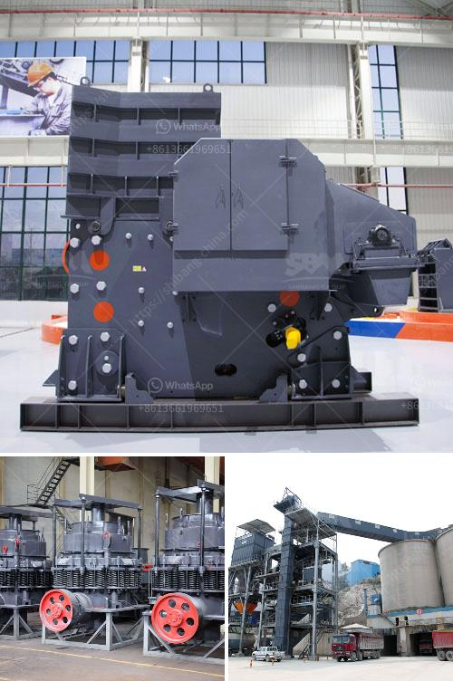

<h3>roller mill type p500</h3>
The roller mill type P500 is an innovative and advanced milling machine designed to efficiently process a variety of materials. With its unparalleled performance, this machine has become a crucial asset in various industries, including agriculture, food processing, and pharmaceuticals.

One of the primary advantages of the roller mill type P500 is its ability to provide consistent and uniform particle size reduction. This is achieved through a unique roller system that ensures the material is evenly ground throughout the milling process. The rollers are strategically positioned and designed to apply optimal pressure, resulting in an excellent quality end product.

Another key feature of the roller mill type P500 is its versatility. Whether dealing with grains, seeds, or other materials, this machine can handle a wide range of products. This makes it an essential tool for farmers, as it enables them to process their own grains or feed efficiently. Moreover, food processing companies can benefit from its ability to produce high-quality flours and powders with minimal effort.

In addition to its efficiency and versatility, the roller mill type P500 is also highly durable and easy to maintain. Its robust construction ensures maximum longevity and reliable performance in demanding industrial environments. Furthermore, the machine is designed with user-friendly features, allowing for effortless operation and maintenance. This makes it an ideal choice for businesses looking to streamline their milling process and reduce downtime.

Moreover, the roller mill type P500 offers enhanced safety features to protect operators and reduce workplace accidents. With its integrated systems and safety mechanisms, the machine guarantees a secure milling process. This not only ensures the well-being of employees but also contributes to increased productivity and efficiency.

Furthermore, the roller mill type P500 is equipped with advanced technology and automation capabilities. This allows for precise control over the milling process and enhances productivity. Operators can easily adjust parameters such as speed, pressure, and feed rate, ensuring optimal results for each specific material. Additionally, the machine's automation features enable remote monitoring and control, further streamlining operations and reducing labor costs.

Overall, the roller mill type P500 is a game-changer in the milling industry. Its exceptional performance, versatility, durability, and safety features make it a valuable investment for any business involved in material processing. Whether milling grains, seeds, or other materials, this machine guarantees efficient and consistent results, while minimizing maintenance requirements and maximizing productivity.

In conclusion, the roller mill type P500 is a revolutionary milling machine that provides numerous benefits to various industries. Its ability to deliver consistent and high-quality results, combined with its versatility and ease of use, make it an indispensable tool for farmers, food processors, and manufacturers. With its advanced technology and safety features, it offers both reliable performance and a safer working environment. If you are searching for a milling solution that can optimize production and streamline operations, the roller mill type P500 is the ultimate choice.
<h3>Contact us</h3><ul><li><strong>Whatsapp:&nbsp;<a href="https://wa.me/8613661969651">+8613661969651</a></strong></li><li><a href="https://swt.shibang-china.com/?git&amp;zhl&amp;roller mill type p500"><strong>Online Service(chat now)</strong></a></li></ul><h3>Related</h3><ul><li><a href='vertical grinding machine manufacturers.md'>vertical grinding machine manufacturers</a></li><li><a href='industria de la piedra caliza en m.md'>industria de la piedra caliza en m</a></li><li><a href='quarry aggregate crusher manufacturing process ppt.md'>quarry aggregate crusher manufacturing process ppt</a></li><li><a href='small scale gold mining equipment in ghana price.md'>small scale gold mining equipment in ghana price</a></li><li><a href='rock drills for sale in south africa.md'>rock drills for sale in south africa</a></li></ul>