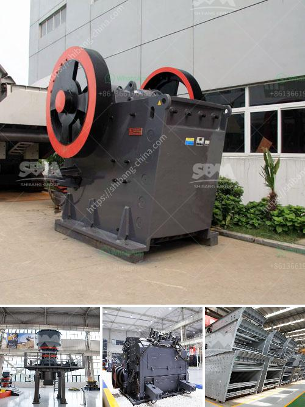

<h3>roller raymond mill</h3>
The roller Raymond mill is a commonly utilized machine for grinding minerals and other materials in various industries. With its diverse and high-quality grinding capabilities, it has become an essential tool in the manufacturing and processing sectors.

One of the key features of the roller Raymond mill is its efficiency in grinding. The machine's design allows for a large amount of material to be ground at a time, leading to significant production output. This efficiency enables companies to meet their production targets and minimize downtime.

Additionally, the roller Raymond mill offers versatility in terms of the range of materials it can grind. From limestone to quartz, from coal to iron ore, the mill can handle a wide variety of materials with ease. This attribute makes it a preferred choice for many industries that require grinding operations as part of their manufacturing processes.

Another advantage of the roller Raymond mill is its low maintenance requirements. The maintenance procedures for this machine are straightforward, and companies can easily train their staff to handle routine maintenance tasks. This ensures that the mill operates effectively for an extended period of time, saving both time and money.

Furthermore, the roller Raymond mill is equipped with advanced control systems, allowing for precise adjustments to be made during the grinding process. This level of control ensures consistent quality and particle size distribution of the final product. Companies can rely on the roller Raymond mill to deliver consistent and high-quality outputs, meeting their customers' demands.

In conclusion, the roller Raymond mill is an efficient and versatile grinding solution that offers numerous benefits to various industries. Its ability to grind a wide range of materials, coupled with its low maintenance requirements and advanced control systems, make it an indispensable tool for many manufacturing and processing operations. Companies looking to enhance their grinding operations and optimize productivity should consider investing in a roller Raymond mill.
<h3>Contact us</h3><ul><li><strong>Whatsapp:&nbsp;<a href="https://wa.me/8613661969651">+8613661969651</a></strong></li><li><a href="https://swt.shibang-china.com/?git&amp;zhl&amp;roller raymond mill"><strong>Online Service(chat now)</strong></a></li></ul><h3>Related</h3><ul><li><a href='quarry equipment leasing companies in nigeria.md'>quarry equipment leasing companies in nigeria</a></li><li><a href='mini stone jaw crushers.md'>mini stone jaw crushers</a></li><li><a href='cone crusher working.md'>cone crusher working</a></li><li><a href='portable crusher in malaysia.md'>portable crusher in malaysia</a></li><li><a href='rock crusher china.md'>rock crusher china</a></li></ul>