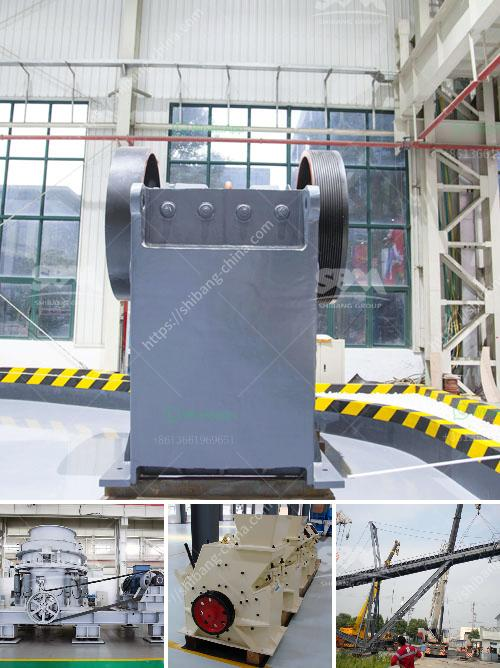

<h3>rotary dryer in cement industry</h3>
The cement industry relies on many different processes and pieces of equipment to efficiently produce the high-quality cement demanded by customers around the world. One such key piece of equipment is the rotary dryer.

The rotary dryer helps cement plants to quickly and efficiently dry a wide variety of materials, including limestone, clay, coal, and other additives. With the drying process taking place in a rotary drum, these dryers provide an effective method for transferring heat energy to the material being processed.

One of the primary benefits of a rotary dryer in the cement industry is its ability to quickly and evenly dry the materials. This is crucial as moisture content plays a significant role in the quality and durability of the final cement product. By removing excess moisture, the rotary dryer ensures that the materials are properly prepared for the subsequent stages of the cement manufacturing process.

In addition to drying the materials, rotary dryers also provide an opportunity for thermal processing. Many cement plants use dryer systems to conduct various thermal treatments such as calcination and pyrolysis. These processes involve subjecting the materials to high temperatures, allowing for chemical reactions to occur that can enhance the final properties of the cement.

The versatility of rotary dryers makes them an essential component of cement production. Whether it's drying limestone to remove moisture or conducting thermal treatments to enhance properties, these dryers can handle a wide range of materials and processes.

Another advantage of rotary dryers in the cement industry is their reliability and durability. These machines are designed to operate continuously in demanding environments, withstanding the high temperatures, abrasive materials, and heavy loads commonly found in cement plants. Furthermore, advancements in design and technology have made modern rotary dryers more energy-efficient, reducing operating costs and environmental impact.

To ensure optimal performance, regular maintenance and inspections are crucial for rotary dryers in the cement industry. Proper lubrication of components, inspection of seals and bearings, and monitoring of heat and airflow are some of the preventive measures that can help extend the lifespan of the dryer and maximize its efficiency.

In conclusion, rotary dryers play a vital role in the cement industry by efficiently drying and thermal processing materials used in cement production. Their ability to remove excess moisture and conduct thermal treatments enhances the quality and reliability of the final cement product. The durability and reliability of these machines, along with their energy efficiency, make them an essential component of any cement plant. Regular maintenance and inspections are necessary to ensure the optimal performance of rotary dryers, keeping them operating at their best and prolonging their lifespan. With their versatility and reliability, rotary dryers continue to be an indispensable tool in the manufacturing of high-quality cement.
<h3>Contact us</h3><ul><li><strong>Whatsapp:&nbsp;<a href="https://wa.me/8613661969651">+8613661969651</a></strong></li><li><a href="https://swt.shibang-china.com/?git&amp;zhl&amp;rotary dryer in cement industry"><strong>Online Service(chat now)</strong></a></li></ul><h3>Related</h3><ul><li><a href='singh stone crusher nashik.md'>singh stone crusher nashik</a></li><li><a href='company where they sell industrial mills.md'>company where they sell industrial mills</a></li><li><a href='gypsum factory in pakistan.md'>gypsum factory in pakistan</a></li><li><a href='china manufacturers of sand washing machine.md'>china manufacturers of sand washing machine</a></li><li><a href='calcium carbonate plant sell in india.md'>calcium carbonate plant sell in india</a></li></ul>