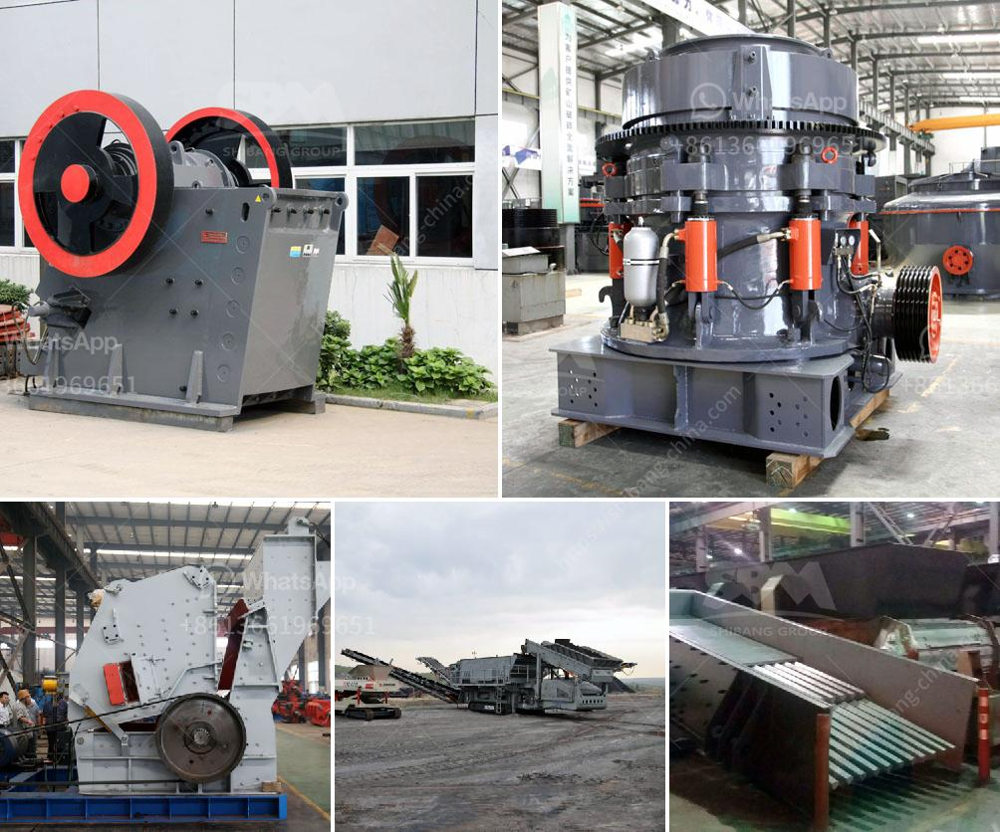

<h3>safety sings for crusher plant and quarry</h3>
When it comes to the safety of workers in industrial environments, there are few areas that are more prone to hazards than those surrounding the operation of machinery like crushers and quarries. With that in mind, the importance of proper signage in these areas cannot be underestimated. By implementing clear and concise safety signs, operators in crusher plants and quarries can significantly reduce the risks associated with these facilities.

One of the most important aspects of signage in these environments is to clearly identify potential hazards. Crushing machines can be extremely dangerous, and operators often work in close proximity to the machinery. When making adjustments to the equipment or performing routine maintenance, proper lockout/tagout procedures should be followed. Signage specifying the need to power off and lock out machinery before performing any work is vital in preventing accidents.

Furthermore, it is crucial to warn workers about the potential dangers of falling rocks and debris. Quarries are inherently unstable environments, and loose rocks can pose a significant threat to those working in the area. Signage that highlights the necessity of wearing hard hats and other protective gear, as well as designating restricted zones, is essential for preventing tragic accidents.

In addition to potential hazards, it is equally necessary to provide guidance and information to workers in these environments. Clear and visible signs should indicate emergency exits, firefighting equipment, and first aid stations. Emergency contact numbers should also be prominently displayed, ensuring that workers can quickly seek help if needed.

Lastly, regular inspection and maintenance of all signage is crucial. Over time, signs may fade, become damaged, or simply lose their effectiveness due to changing circumstances within the plant or quarry. Employers should establish a system for routinely inspecting and replacing signs to ensure they remain visible and legible at all times.

In conclusion, safety signs are an indispensable element in ensuring the well-being of workers in crusher plants and quarries. By clearly identifying potential hazards, providing guidance and information, and regularly maintaining signs, operators can significantly reduce the risks associated with these environments. Ultimately, the implementation of proper signage is a proactive and responsible step towards creating a safer workplace for all.
<h3>Contact us</h3><ul><li><strong>Whatsapp:&nbsp;<a href="https://wa.me/8613661969651">+8613661969651</a></strong></li><li><a href="https://swt.shibang-china.com/?git&amp;zhl&amp;safety sings for crusher plant and quarry"><strong>Online Service(chat now)</strong></a></li></ul><h3>Related</h3><ul><li><a href='hard stone aggregate crusher price.md'>hard stone aggregate crusher price</a></li><li><a href='equipo del molino de bolas 750 hp precio del motor.md'>equipo del molino de bolas 750 hp precio del motor</a></li><li><a href='marble crushing line.md'>marble crushing line</a></li><li><a href='terrex stone crushers in usa.md'>terrex stone crushers in usa</a></li><li><a href='black powder ball mill grinder.md'>black powder ball mill grinder</a></li></ul>