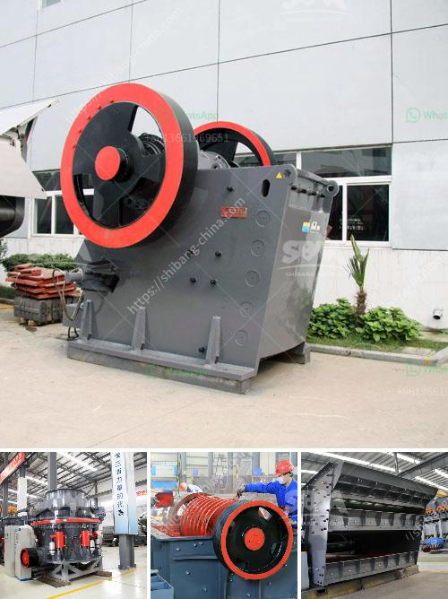

<h3>sale for stone crusher</h3>
Stone crushing machine is specialized in producing mining machinery, including various types of stone crushing plants, such as jaw crushers, impact crushers, hammer crushers, cone crushers, mobile crushers, etc. It's designed to meet clients's crushing requirements. Stone crushing machine consists of jaw crusher, impact crusher, cone crusher, etc. Stone crushing and screening production lines are widely used in mining, metallurgy, construction, highway, railway, chemical, and other industries.

Stone crushing machine is used to crush large-sized rocks into fragments by the ways of extruding, splitting, bending, impacting, and rolling. Commonly used stone crushing machines are stone jaw crusher, stone cone crusher, hammer stone crusher, roll stone crusher, and stone impact crusher, etc. Stone jaw crusher for coarse crushing The jaw stone crushing machine is commonly used for the coarse crushing. It can crush the unprocessed raw material with all sizes into even particles. The stone jaw crusher can work together with other ore processing plants and sand making plants. Since the Fote stone jaw crusher enjoys the features of big crushing ratio, even particle size, simple structure, and convenient maintenance, it can be a good helper for users. Stone cone crusher for sale is widely used in gold ore crusher.

Our company has many gold ore crushing machine for sale. we have two series of gold cone crusher for sale: CS cone crusher and HPC series cone crusher. The new series of HPC cone crusher with high-efficiency and hydraulic pressure equipment is adopted three protecting equipment such as protecting oilcan, locking oilcan and hydraulic driving oilcan. They not only protect the machinery, but also could deal with troubles without disassembly the parts. HPC cone crusher with hydraulic clamping the electrical chamber clean, can increase the crushing capacity; Hydraulic cleaning cavity system and the hydraulic classification cavity system can be processed crushing and efficient operation.

Our stone crusher is mainly used for stone coarse crushing as well as some series of grinding, drying, crushing, shaping and screening of mineral ores. Our star product-PEW construction waste crusher adopts world-class manufacturing technology and advanced digital parts processing equipment, which is designed and improved by our experts on basis of their more than 20 years' crusher manufacturing and design experience.

The construction waste crusher developed by our company adopts advanced selective crushing technology, which can crush construction waste into 5-40mm of various grain sizes. The finished product has good granularity, uniformity, and can also be fine-tuned according to individual needs. The construction waste crusher can reduce project costs, improve project efficiency, and create economic benefits. It is an ideal equipment for the construction waste processing industry.

In summary, stone crushing machine has always been a hot topic in the mining industry, and it becomes even more popular in recent years due to the market demand and environmental protection. Crushing machine is the key equipment in stone production line to ensure the smooth progress of production for users. We believe that with the continuous innovation of science and technology, stone crushing machine will become even more advanced and efficient in the future, creating greater value for customers.
<h3>Contact us</h3><ul><li><strong>Whatsapp:&nbsp;<a href="https://wa.me/8613661969651">+8613661969651</a></strong></li><li><a href="https://swt.shibang-china.com/?git&amp;zhl&amp;sale for stone crusher"><strong>Online Service(chat now)</strong></a></li></ul><h3>Related</h3><ul><li><a href='vibrating grizzly feeder 35 ton per jam.md'>vibrating grizzly feeder 35 ton per jam</a></li><li><a href='portable stone crusher rajasthan.md'>portable stone crusher rajasthan</a></li><li><a href='fly ash grinding machine manufacturar in india.md'>fly ash grinding machine manufacturar in india</a></li><li><a href='raymond grinder mill pakistan.md'>raymond grinder mill pakistan</a></li><li><a href='talc rock crusher.md'>talc rock crusher</a></li></ul>