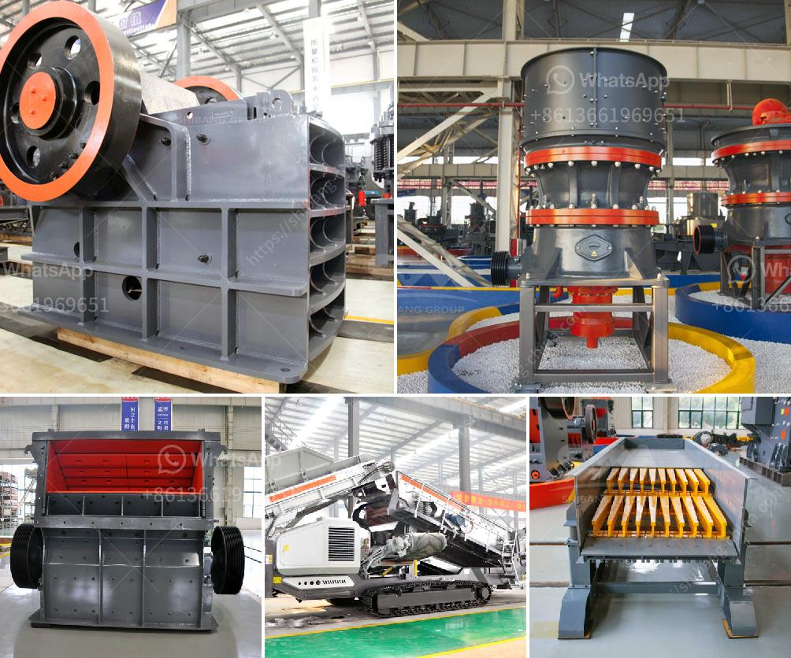

<h3>sale of ball mills used in peru</h3>
Peru, a country known for its rich mineral resources, is experiencing a significant surge in its mining industry. As a result, the demand for equipment, such as ball mills used in mineral processing, has increased. With these mills playing a crucial role in the extraction process, their efficient usage can help Peruvian miners improve their productivity and profitability. This article explores the sale of ball mills in Peru, shedding light on the benefits they offer to the mining sector.

Ball mills have become indispensable in mineral processing due to their ability to grind materials into fine powder. These mills are commonly used to extract copper, gold, and other valuable minerals from the ore. With the surge in mining activities across Peru, the demand for ball mills has witnessed a considerable growth trajectory.

By leveraging the principles of impact and attrition, ball mills help refine crushed ore into valuable particles of uniform size. This crucial step optimizes the mineral extraction process, ensuring that the maximum amount of valuable ore is recovered. The efficient usage of ball mills can lead to increased yields, reduced energy consumption, and enhanced overall efficiency in mineral processing plants.

Peru's vibrant mining industry fuels a thriving local economy. To meet the growing demand for ball mills, Peruvian miners are collaborating with global manufacturers specializing in mineral processing equipment. The combination of local expertise and global technological advancements ensures that the mills cater to the specific needs and challenges of Peru's mining sector.

Mining operations often face scrutiny due to their potential impact on the environment. Manufacturers are investing in research and development to address such concerns and develop more sustainable ball mill solutions. Advanced technologies are being implemented to minimize power consumption, utilize greener energy sources, and reduce water usage. By adopting these eco-friendly practices, miners in Peru can mitigate their environmental footprint while maintaining operational efficiency.

With the growing variety of ball mill options available in the market, Peruvian miners need to consider several factors before making a purchase. Size, capacity, power requirements, and maintenance needs must be carefully evaluated. Collaborating with trusted manufacturers and relying on expert advice can help miners make an informed decision regarding the most suitable ball mill for their specific mineral processing requirements.

As Peru's mining industry continues to thrive, the sale of ball mills used in mineral processing is witnessing a remarkable upswing. These mills play an integral role in enhancing the efficiency of mineral extraction processes, ensuring higher yields and reduced energy consumption. By keeping pace with global technological advancements and adopting sustainable practices, Peruvian miners can optimize their operations while minimizing their environmental impact. Ultimately, the growing sale of ball mills in Peru represents a promising trend, enabling the mining sector to harness its abundant mineral resources more efficiently.
<h3>Contact us</h3><ul><li><strong>Whatsapp:&nbsp;<a href="https://wa.me/8613661969651">+8613661969651</a></strong></li><li><a href="https://swt.shibang-china.com/?git&amp;zhl&amp;sale of ball mills used in peru"><strong>Online Service(chat now)</strong></a></li></ul><h3>Related</h3><ul><li><a href='new small gold processing equipment for sale in usa.md'>new small gold processing equipment for sale in usa</a></li><li><a href='used rock fine crusher for sale.md'>used rock fine crusher for sale</a></li><li><a href='gypsum board manufacturing plant cost.md'>gypsum board manufacturing plant cost</a></li><li><a href='mobile gold processing plant for sale.md'>mobile gold processing plant for sale</a></li><li><a href='chromite crushing plant in karachi pakistan sale.md'>chromite crushing plant in karachi pakistan sale</a></li></ul>