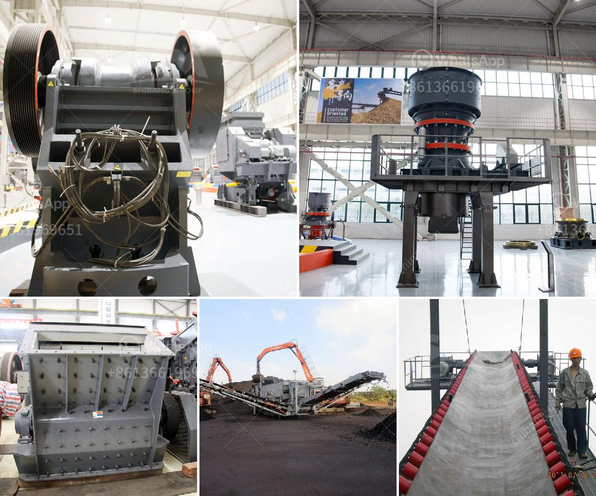

<h3>sample business plan for stone crusher in bolivia</h3>
A stone crushing business plan is a formal statement of a set of business goals that the company wants to achieve in terms of stone crushing operations. In other words, it aims to explain how the company will increase its profitability by implementing certain measures over a specific period of time.

The business plan for stone crusher plants should include detailed information about the financial health of the company, projected sales and profits, market analysis, marketing strategies, target market, competition analysis, production process, and equipment requirements.

Firstly, it is important to carry out a comprehensive market analysis to determine the demand for crushed stones in the region. This analysis should include the current and future construction projects, the market size, potential customers, and their preferences.

Next, the business plan should outline the marketing strategies to attract and retain customers. This could involve advertising in local newspapers, online platforms, and participating in trade fairs and expos. The company should also establish relationships with contractors, builders, and architects who might recommend their services to potential clients.

Furthermore, the business plan should define the target market and identify the competition. This information is crucial for developing a pricing strategy that is both competitive and profitable. An analysis of the competition will help in identifying unique selling points and differentiating the company from its competitors.

In terms of production, the plan should outline the process of crushing stones. This includes selecting the right machinery and equipment needed for efficient operation. It should also include hiring skilled and experienced staff to handle the machines and oversee the production process.

To ensure financial stability, the business plan should provide a detailed forecast of sales and profits for the next few years. This will help the company in estimating the amount of investment required to expand operations or make improvements. It should also detail the sources of funding and the potential returns on investment.

Finally, the business plan should address any legal and regulatory requirements, environmental considerations, and health and safety measures that need to be adhered to. This is important to ensure compliance with government regulations and to maintain a positive reputation within the industry.

In conclusion, writing a business plan for a stone crushing company requires careful planning and research. It should provide a clear roadmap for the company's future growth and success. With the right strategies and implementation, a stone crushing company can thrive in the construction industry in Bolivia.
<h3>Contact us</h3><ul><li><strong>Whatsapp:&nbsp;<a href="https://wa.me/8613661969651">+8613661969651</a></strong></li><li><a href="https://swt.shibang-china.com/?git&amp;zhl&amp;sample business plan for stone crusher in bolivia"><strong>Online Service(chat now)</strong></a></li></ul><h3>Related</h3><ul><li><a href='changsha kaiyuan coal crusher.md'>changsha kaiyuan coal crusher</a></li><li><a href='lime powder production equipment.md'>lime powder production equipment</a></li><li><a href='crusher manufacturers prices.md'>crusher manufacturers prices</a></li><li><a href='indonesia jaw crusher.md'>indonesia jaw crusher</a></li><li><a href='crusher for sale in nigeria.md'>crusher for sale in nigeria</a></li></ul>