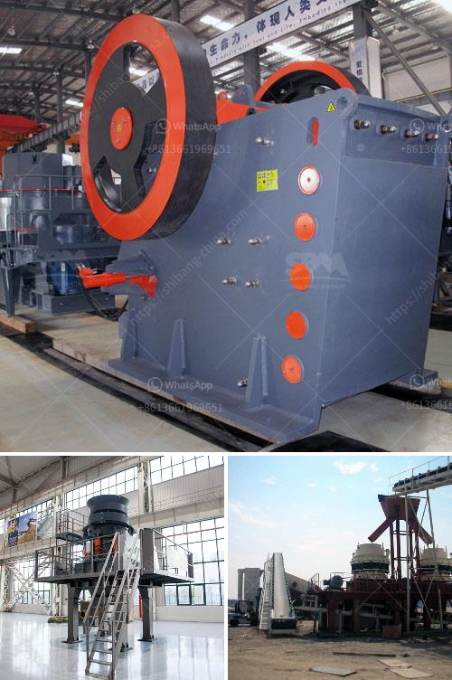

<h3>sand and gravel crusher machine for sale philippines</h3>
Sand and gravel are essential materials in the construction industry. They are used for building roads, houses, and other structures. It is no wonder that the demand for these materials constantly increases. In the Philippines, there has been a steady growth in the construction sector over the years, and this has propelled the demand for sand and gravel crushers to soar.

Crusher machine for sale is the mechanical equipment used to crush minerals. Generally, a crushing machine can crush different materials, such as river pebbles, granite, limestone, basalt, ore, rock, stone, gypsum, coal, etc. According to the feed particle size and discharge size, the process of crushing includes three stages, coarse crushing, medium crushing, and fine crushing.

In the Philippines, there are many options for customers to choose from, including jaw crushers, cone crushers, impact crushers, etc. However, these different crusher machines have different working principles. And that will have a great impact on the crushing effect. Here in this article, we mainly introduce the various sand and gravel crusher machine for sale in the Philippines.

There are different types of crushing machines available and they vary in size and specification. These machines are used to crush gravel and sand into specific sizes for construction purposes. The crusher machine is divided into a jaw crusher, cone crusher, impact crusher, VSI crusher, mobile crusher, and portable crusher.

Jaw crusher is suitable for crushing materials with compressive strength not exceeding 320 MPa. It is the preferred equipment for coarse crushing of various types of rocks. In order to have the excellent stability, JC jaw crusher adopts high-quality casting steel structure, and equips with the large type casting fly wheel, heavy loading eccentric shaft and more larger and durable ball shape rolling bearing.

Cone crusher is mainly used for medium-fine crushing, such as iron ore, non-ferrous metal ore, granite, limestone, quartzite, sandstone, river pebble, etc. For hard stones such as cobblestone, granite, coal gangue, if adopt the crushing process of jaw crusher + sand maker, it may cause serious wear of the sand maker. In order to relieve the pressure of the sand making machine, a cone crusher is added in the middle.

Impact crusher can crush aggregates with excellent granularity because of flexible and variable adjustment methods, making the diameter of final aggregates that can be produced reach 0-5mm, 5-10mm, 10-15mm.In addition, people are all inclined to purchasing an impact rock crusher because it can reduce various aggregates to beautiful particle size and little needle content.

VSI crusher is the original rock-on-rock crushing equipment used in the third of fourth stage of crushing circuits. Pre: 100-120tph Stationary Crushing Line in Kenya Next: Portable Crushing Plant Becomes More and More Popular Philippines Crusher About Philippines Crusher. Saint Kitts and Nevis Saint Lucia Saint Vincent and the Grenadines Samoa San Marino Sao Tome and Principe Saudi Arabia Senegal.

The Philippines is rich in gravel materials such as riverstones, boulders whose investment, price and production line are the most concerned issues for customers. Introduction of sand and gravel production line The river stones are uniformly sent to the PE600×750 jaw crusher by the vibrating feeder for coarse crushing into 65-160mm size. And then the coarsely crushed material is sent to the PSG900 cone crusher by the belt conveyor for secondary crushing into 13-38mm, then is fed into the sand maker for further crushing.

The finely crushed material is sent to the vibrating screen for screening, and the material larger than 5mm is returned to the sand maker to be crushed again, forming a closed-cycle. The material smaller than 5mm is sent to the spiral sand washing machine for cleaning, and the finished product is conveyed to the finished product warehouse through the belt conveyor.

In summary, gravel crusher machine for sale philippines is mainly used for crushing various stone materials. According to the principle of crushing, the output of different types of crushers is also different. So it is recommended that customers choose the appropriate model according to their own needs and production demand.
<h3>Contact us</h3><ul><li><strong>Whatsapp:&nbsp;<a href="https://wa.me/8613661969651">+8613661969651</a></strong></li><li><a href="https://swt.shibang-china.com/?git&amp;zhl&amp;sand and gravel crusher machine for sale philippines"><strong>Online Service(chat now)</strong></a></li></ul><h3>Related</h3><ul><li><a href='i need a second hand mobile stone crusher south africa.md'>i need a second hand mobile stone crusher south africa</a></li><li><a href='industrial application of ball mills.md'>industrial application of ball mills</a></li><li><a href='quartz powder machine manufacturer in india.md'>quartz powder machine manufacturer in india</a></li><li><a href='used silica crushing plants for sale.md'>used silica crushing plants for sale</a></li><li><a href='100tph raw mill specification.md'>100tph raw mill specification</a></li></ul>