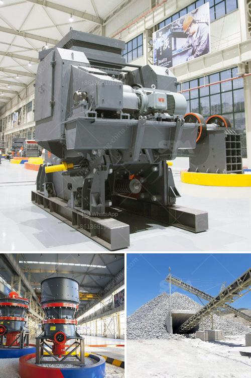

<h3>sand and gravel wash plants usa</h3>
Sand and gravel wash plants have become increasingly popular in the United States in recent years. As the demand for clean, high-quality sand and gravel continues to rise, so does the need for efficient and reliable wash plants. These plants are designed to remove dirt, sediment, and other impurities from the sand and gravel, ensuring that the final product is of the highest quality.

One of the leading providers of sand and gravel wash plants in the USA is COMPANY X. They have been in the industry for many years and have a proven track record of delivering exceptional products and services to their customers. Their wash plants are known for their efficiency, durability, and low maintenance requirements, making them the ideal choice for operators looking to maximize their productivity and profitability.

The sand and gravel wash plants offered by COMPANY X come in a range of sizes, from small portable plants to large stationary installations. This allows operators to choose the plant that best suits their specific needs and production requirements. Additionally, the wash plants are designed with ease of use in mind, featuring user-friendly controls and systems that make operation and maintenance a breeze.

One of the key features of COMPANY X's sand and gravel wash plants is their ability to recover valuable materials that would otherwise be lost. Through a combination of mechanical and chemical processes, the plants are able to separate and recover fine particles of sand, gravel, and other materials, maximizing the yield and value of the final product.

In conclusion, sand and gravel wash plants are essential for producing clean and high-quality sand and gravel. With the increasing demand for these materials in the United States, it is crucial for operators to invest in efficient and reliable wash plants. COMPANY X is a trusted provider of wash plants, offering a range of options that cater to different needs and production requirements. By investing in their wash plants, operators can ensure that they are able to deliver the highest quality sand and gravel to their customers while maximizing their productivity and profitability.
<h3>Contact us</h3><ul><li><strong>Whatsapp:&nbsp;<a href="https://wa.me/8613661969651">+8613661969651</a></strong></li><li><a href="https://swt.shibang-china.com/?git&amp;zhl&amp;sand and gravel wash plants usa"><strong>Online Service(chat now)</strong></a></li></ul><h3>Related</h3><ul><li><a href='tata stone crusher machines.md'>tata stone crusher machines</a></li><li><a href='small concrete crushers for low capacity.md'>small concrete crushers for low capacity</a></li><li><a href='copper crusher suppliers in zambia.md'>copper crusher suppliers in zambia</a></li><li><a href='mtm grinding mill.md'>mtm grinding mill</a></li><li><a href='ballast crusher price.md'>ballast crusher price</a></li></ul>