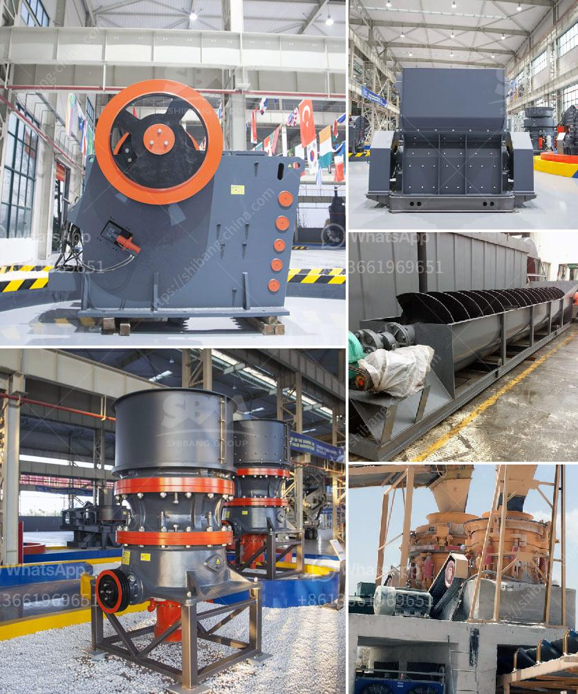

<h3>sand crusher machinery china</h3>
China, the world's largest infrastructure investor, is no stranger to the challenges of building booming cities, roads, and bridges. With rapid urbanization and an ever-increasing demand for construction materials, the need for efficient machinery is paramount. Enter sand crusher machinery – a revolutionary solution that has the potential to reshape the infrastructure industry in China.

Sand crusher machinery, also known as sand making machine, refers to a vertical shaft impact crusher. It is a key equipment in the production line of sand and stone materials for construction sites, highways, railways, bridges, and other industries. With the rapid development of China's urbanization and infrastructure, the demand for sand and gravel is constantly increasing. Traditional natural sand resources are being depleted, and the extraction process is environmentally destructive. Hence, the need for sand crusher machinery arises.

One of the key advantages of sand crusher machinery is its ability to produce high-quality artificial sand. Unlike natural sand, which varies in quality and consistency depending on its source, artificial sand produced by sand crushers is uniform in size, shape, and gradation. This consistency makes it ideal for various construction applications such as concrete production, roadbase, and foundation work. The use of sand crusher machinery ensures uniformity in structural strength and durability, reducing the risks associated with using natural sand.

Moreover, sand crusher machinery is designed to produce sand particles with a specific shape, commonly known as cubical sand. Cubical sand has distinct advantages over irregular-shaped sand particles. It offers better workability, improves concrete strength, and enhances the overall quality of the construction material. With sand crusher machinery, the production of cubical sand can be controlled through various settings and adjustments, ensuring the desired particle shape is achieved.

Another crucial benefit of sand crusher machinery is its efficiency in saving natural resources. By utilizing the crushing action of the machine, sand crusher machinery can transform large rocks and stones into sand particles of desired size. This process eliminates the need for traditional sand extraction methods such as dredging rivers, which often leads to ecological damage. By relying on sand crusher machinery, China can preserve its natural resources while meeting the growing demands of the construction industry.

Furthermore, sand crusher machinery is characterized by its low operating and maintenance costs. With advancements in technology, modern sand crushers are designed to deliver consistent performance while requiring minimal downtime for maintenance. This ensures maximum operational efficiency for construction companies, reducing their overall expenses and increasing their profits.

To meet the burgeoning demand for sand crusher machinery, a number of leading Chinese manufacturers have emerged in recent years. These manufacturers specialize in developing and producing innovative sand crusher machinery that meets the unique requirements of the Chinese market. By leveraging advanced technologies and incorporating sustainable practices, these manufacturers contribute to the sustainable development of China's infrastructure industry.

In conclusion, sand crusher machinery is revolutionizing the way China meets its infrastructure needs. By producing high-quality artificial sand, contributing to resource conservation, and minimizing operating costs, sand crusher machinery offers a sustainable solution for the construction industry. As China continues to invest in its urbanization and infrastructure, the demand for sand crusher machinery is poised to grow, driving innovation and development in this sector.
<h3>Contact us</h3><ul><li><strong>Whatsapp:&nbsp;<a href="https://wa.me/8613661969651">+8613661969651</a></strong></li><li><a href="https://swt.shibang-china.com/?git&amp;zhl&amp;sand crusher machinery china"><strong>Online Service(chat now)</strong></a></li></ul><h3>Related</h3><ul><li><a href='crusher machine in gujranwala location.md'>crusher machine in gujranwala location</a></li><li><a href='quartz stone powder machine manufacturing in india.md'>quartz stone powder machine manufacturing in india</a></li><li><a href='robo sand machinery cost manufactures.md'>robo sand machinery cost manufactures</a></li><li><a href='wet process of cement production.md'>wet process of cement production</a></li><li><a href='egypt gypsum powder manufacturer.md'>egypt gypsum powder manufacturer</a></li></ul>