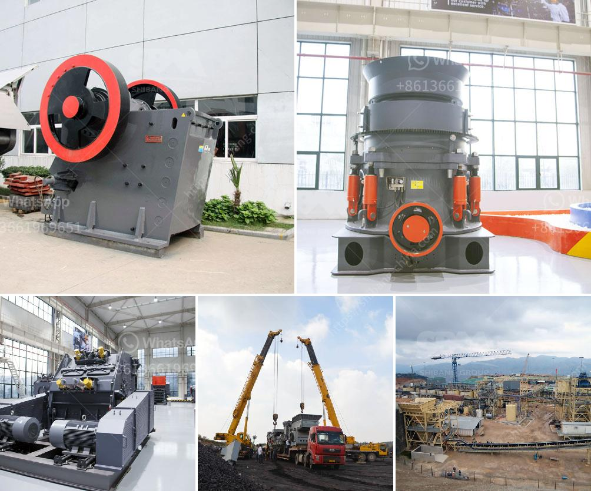

<h3>sand gold crusher equipment made in canada</h3>
Sand gold mining is a popular and lucrative industry worldwide. Extraction of gold from sand is a delicate and complex process that requires the right tools and equipment. One such tool that has revolutionized the gold mining industry is the sand gold crusher equipment made in Canada.

Canada is renowned for its vast natural resources, including gold reserves. With its advanced mining technology and equipment manufacturing capabilities, Canada has become a global leader in the gold mining industry. The sand gold crusher equipment made in Canada is a testimony to the country's excellence in designing and manufacturing top-notch mining equipment.

The sand gold crusher equipment made in Canada is specifically designed to handle the unique challenges of extracting gold from sand. Unlike traditional gold mining methods, which rely on expensive machinery and complex processes, the sand gold crusher equipment simplifies the gold extraction process.

This equipment consists of a crusher and a concentrator, both specifically designed for efficient and effective sand gold extraction. The crusher is designed to break down the sand and separate particles containing gold from the rest of the sediment. It uses a combination of gravity and mechanical force to achieve this separation.

Once the gold particles are separated, the concentrator comes into play. The concentrator is responsible for further refining and concentrating the gold particles. It uses advanced techniques such as centrifugal force to separate the heavier gold particles from the lighter sand particles.

The sand gold crusher equipment made in Canada is also compact and portable, making it suitable for small-scale mining operations. Its ease of use and low maintenance requirements make it a popular choice among individual miners and small mining companies.

Another advantage of the sand gold crusher equipment made in Canada is its durability and reliability. It is built to withstand harsh mining conditions and can operate efficiently even in remote and challenging environments. This ensures that miners can rely on this equipment to extract gold from sand without any interruptions or breakdowns.

Furthermore, the sand gold crusher equipment made in Canada is environmentally friendly. It operates with minimal noise and vibration, reducing its impact on the surrounding ecosystem. It also consumes less electricity, thereby reducing energy consumption and carbon emissions.

The sand gold crusher equipment made in Canada has been widely adopted by gold miners worldwide. Its effectiveness, efficiency, and reliability have made it an indispensable tool in modern gold mining operations. With this equipment, gold miners can extract gold from sand more efficiently and at a lower cost, making sand gold mining a viable and profitable venture.

In conclusion, the sand gold crusher equipment made in Canada has revolutionized the gold mining industry. Its advanced design, compactness, durability, environmental friendliness, and effectiveness have made it a preferred choice for gold miners worldwide. With this equipment, gold miners can extract gold from sand efficiently and profitably, solidifying Canada's position as a global leader in the gold mining industry.
<h3>Contact us</h3><ul><li><strong>Whatsapp:&nbsp;<a href="https://wa.me/8613661969651">+8613661969651</a></strong></li><li><a href="https://swt.shibang-china.com/?git&amp;zhl&amp;sand gold crusher equipment made in canada"><strong>Online Service(chat now)</strong></a></li></ul><h3>Related</h3><ul><li><a href='stone crushers from china.md'>stone crushers from china</a></li><li><a href='fintec mobile screens for sale australia.md'>fintec mobile screens for sale australia</a></li><li><a href='ball mills for measured mining.md'>ball mills for measured mining</a></li><li><a href='stone crushers for sale in south korea.md'>stone crushers for sale in south korea</a></li><li><a href='gypsum plasterboard manufacturing process.md'>gypsum plasterboard manufacturing process</a></li></ul>