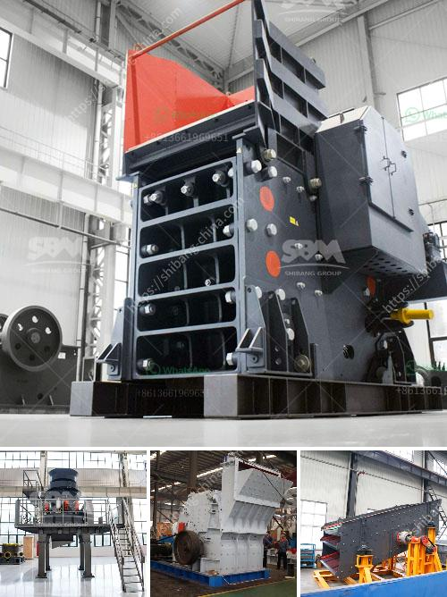

<h3>sand making plant supplier process crusher</h3>
A sand making plant supplier process crusher is a machine used to produce artificial sand, which is extensively used in construction industry. In recent years, the rapid development of construction industry has led to an increasing demand for artificial sand. With the depletion of natural resources and the increasing environmental concerns, the use of artificial sand has become more popular.

The sand making plant supplier process crusher works by breaking down large rocks into smaller pieces. These small pieces are then sent through a series of crushers to create a fine and consistent particle size. The crushed material is then washed, screened, and classified into different sizes to meet the specific requirements of construction projects.

The process of producing artificial sand begins with the raw materials. High-quality sand requires high-quality raw materials, such as limestone, granite, basalt, or river pebbles. These raw materials are extracted from quarries or rivers and then transported to the sand making plant supplier process crusher.

Once the raw materials arrive at the plant, they are loaded into a primary crusher, which breaks down the rocks into smaller pieces. The primary crusher is usually a jaw crusher or gyratory crusher, capable of reducing the raw materials to a size of less than 200mm.

The secondary crushers, such as cone crushers or impact crushers, further reduce the size of the crushed material. These crushers are capable of creating a consistent and fine particle size, which is essential for the production of high-quality artificial sand.

After the material has been crushed, it is then washed to remove any impurities or contaminants. This is typically done using water and a series of screens and classifiers. The washing process helps to ensure that the final product is clean and free from any unwanted particles.

Once the material has been washed, it is then dried and sorted into different sizes. This is done using a series of vibrating screens, which separate the material into different grades based on its particle size. The sorted material is then stored in silos or stockpiled in preparation for delivery to construction sites.

The sand making plant supplier process crusher is a crucial step in the production of artificial sand. It ensures that the final product is of high quality and meets the specific requirements of construction projects. By using the sand making plant supplier process crusher, construction companies can produce artificial sand that is not only cost-effective but also environmentally friendly.
<h3>Contact us</h3><ul><li><strong>Whatsapp:&nbsp;<a href="https://wa.me/8613661969651">+8613661969651</a></strong></li><li><a href="https://swt.shibang-china.com/?git&amp;zhl&amp;sand making plant supplier process crusher"><strong>Online Service(chat now)</strong></a></li></ul><h3>Related</h3><ul><li><a href='funding for establishment of stone crushers.md'>funding for establishment of stone crushers</a></li><li><a href='components for cone crusher major.md'>components for cone crusher major</a></li><li><a href='rock crusher plant for sale.md'>rock crusher plant for sale</a></li><li><a href='marble crushing line.md'>marble crushing line</a></li><li><a href='top 20 coal mining companies in indonesia.md'>top 20 coal mining companies in indonesia</a></li></ul>