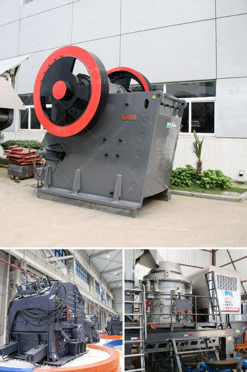

<h3>sand manufacturing small scale</h3>
Sand plays a vital role in various sectors, including construction, infrastructure development, and manufacturing industries. However, the ever-increasing demand for sand has resulted in serious environmental issues such as depletion of riverbeds, erosion, and habitat destruction. To tackle these challenges and promote sustainability, the concept of sand manufacturing on a small scale has gained popularity.

Small-scale sand manufacturing involves the production of artificial sand using machinery designed specifically for this purpose. This approach offers several advantages over conventional methods, making it a viable solution for local communities.

One key advantage of small-scale sand manufacturing is the reduced dependence on natural resources. Traditional sand extraction predominantly relies on mining riverbeds and coastal areas, leading to irreversible damage to ecosystems. In contrast, artificial sand production utilizes locally available materials, such as quarry dust or crushed rocks, reducing the need for large-scale extraction.

Furthermore, small-scale sand manufacturing plants can be strategically located near construction sites, minimizing the transportation distance and associated carbon emissions. This not only reduces the environmental footprint but also lowers costs for construction companies.

In terms of quality, artificial sand can be precisely manufactured to meet specific requirements. This ensures consistency in particle size, shape, and composition, leading to improved performance in concrete production and other applications. Additionally, manufacturers have the flexibility to tailor the sand's characteristics according to local needs, enhancing its suitability for different purposes.

Small-scale sand manufacturing also presents job opportunities for local communities. These manufacturing units require skilled and semi-skilled labor, creating employment in areas where traditional sand mining may have resulted in job losses. Moreover, setting up such plants can contribute to skill development and capacity building, fostering economic growth in the region.

To make small-scale sand manufacturing a reality, it is crucial to address potential challenges. Firstly, adequate investment and technical expertise are required to establish and operate these plants efficiently. Governments, private investors, and development organizations should collaborate to provide the necessary support, including funding, training, and technology transfer.

Secondly, it is essential to regulate and monitor small-scale sand manufacturing to ensure compliance with environmental and safety standards. Authorities must establish robust guidelines and enforce strict regulations to prevent any potential adverse effects and safeguard nearby ecosystems.

Furthermore, promoting public awareness and education is crucial to ensure acceptance and understanding of the benefits of small-scale sand manufacturing. Local communities should be engaged in decision-making processes and empowered to actively participate in sustainable sand production initiatives.

In conclusion, small-scale sand manufacturing offers a sustainable solution to the increasing demand for sand while mitigating environmental impacts. By reducing reliance on natural resources, minimizing transportation distances, and creating job opportunities, this approach benefits both the environment and local communities. However, successful implementation requires collaboration between stakeholders, effective regulations, and public support. Embracing small-scale sand manufacturing can pave the way for a more sustainable future.
<h3>Contact us</h3><ul><li><strong>Whatsapp:&nbsp;<a href="https://wa.me/8613661969651">+8613661969651</a></strong></li><li><a href="https://swt.shibang-china.com/?git&amp;zhl&amp;sand manufacturing small scale"><strong>Online Service(chat now)</strong></a></li></ul><h3>Related</h3><ul><li><a href='new quartz plant cost in india.md'>new quartz plant cost in india</a></li><li><a href='crusher 300 sampai 400 ton dan hr dijual.md'>crusher 300 sampai 400 ton dan hr dijual</a></li><li><a href='feldspar crusher unit.md'>feldspar crusher unit</a></li><li><a href='grinding wet ball mill limestone.md'>grinding wet ball mill limestone</a></li><li><a href='stone crusher machine for sale ethiopia.md'>stone crusher machine for sale ethiopia</a></li></ul>