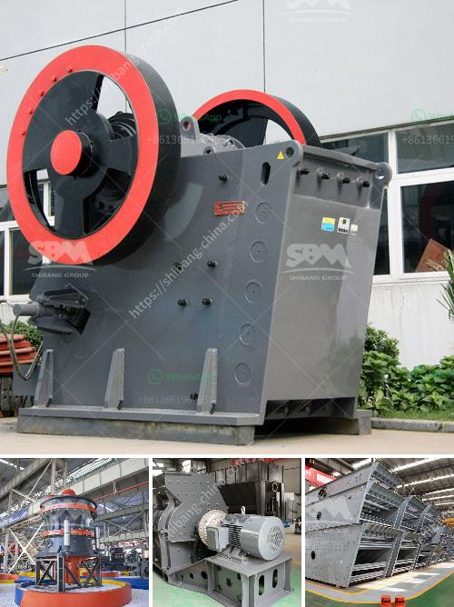

<h3>sand material small crusher machine</h3>
Sand material crushers are widely used in the sand production line and sand-making production line. Sand material crushers require users to provide a certain level of understanding and expertise, so that they can correctly use and select a suitable sand material crusher to achieve good results.

Sand material crushers are also known as sand-making machines. They mainly use the principle of stone impacting stone to crush materials. The materials collide with each other and crush in the crushing cavity. The finished products have good grain shape, and can be used in various construction projects such as highways, railways, and buildings.

The sand material crusher has a wide range of applications. It can crush more than 200 kinds of materials, such as limestone, basalt, granite, river pebble, quartz stone, iron ore, diabase, limestone, calcite, dolomite, construction waste, etc. It has the advantages of flexible operation, high production efficiency, environmental protection, and energy saving.

The sand material crusher consists of a feed hopper, a distributor, a vortex crushing cavity, an impeller, a main shaft assembly, a base, a transmission device, and a motor. The unique lining design of the crushing cavity greatly reduces wear and prolongs the service life of the machine.

In the production of sand material, the particle size of the finished product needs to be controlled, so the sand material crusher is equipped with a screening device. The screening device removes materials with excessive particle size, and the qualified materials are sent to the sand-making machine for further shaping and sanding.

When selecting a sand material crusher, users should consider the nature of the materials to be crushed, the hardness, viscosity, and humidity of the materials, as well as the desired particle size of the finished product. Different materials have different requirements for the crushing equipment. It is recommended to choose a sand material crusher with high wear resistance and good performance.

The sand material crusher is an essential equipment in the sand production line and sand-making production line. It is widely used in the crushing and shaping of various materials, and plays a crucial role in the production of sand and gravel aggregates. With the continuous development of infrastructure construction, the market demand for sand material crushers is also increasing. Manufacturers should improve the technological level of equipment, enhance the research and development of new products, and provide users with more efficient and energy-saving sand material crushers.
<h3>Contact us</h3><ul><li><strong>Whatsapp:&nbsp;<a href="https://wa.me/8613661969651">+8613661969651</a></strong></li><li><a href="https://swt.shibang-china.com/?git&amp;zhl&amp;sand material small crusher machine"><strong>Online Service(chat now)</strong></a></li></ul><h3>Related</h3><ul><li><a href='ball mills machine.md'>ball mills machine</a></li><li><a href='mobile crusher plant for hire in south africa.md'>mobile crusher plant for hire in south africa</a></li><li><a href='stone crushing equipment zenith.md'>stone crushing equipment zenith</a></li><li><a href='best machine brands for quarry.md'>best machine brands for quarry</a></li><li><a href='basic machines used stone crusher.md'>basic machines used stone crusher</a></li></ul>