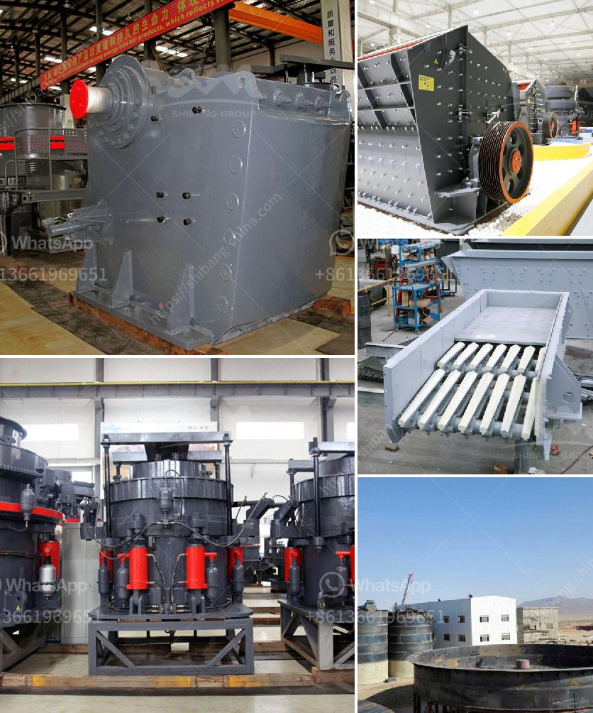

<h3>sand mills for manufacturing</h3>
Sand mills are highly efficient machines used in the manufacturing industry for dispersing and reducing particles in liquid-based materials. These mills play a crucial role in various sectors such as paints, coatings, and pigments, aiding in the production of high-quality products.

Sand mills, also known as bead mills or media mills, operate by agitating the material to be processed with grinding media. The grinding media, typically consisting of small ceramic or glass beads, actively mix and disperse the particles, resulting in a highly homogenous and consistent product.

The design of a sand mill consists of a chamber, which contains the grinding media and the material to be processed. The material is fed into the chamber, where it is continuously agitated by the rotating grinding media. As the particles come into contact with the grinding media, they are reduced in size through a combination of grinding and shearing forces.

One of the key advantages of sand mills is their ability to achieve particle sizes ranging from nanometers to micrometers. This level of precision and control is crucial in industries such as electronics, where fine particles are required for the production of electronic components.

Moreover, sand mills offer high production rates, ensuring efficient and quick manufacturing processes. The continuous agitation and grinding action allow for a constant flow of material, enabling manufacturers to meet high-demand production requirements.

Another significant advantage of sand mills is their versatility. They can process a wide range of materials, including inks, dyes, pigments, coatings, and various other liquid-based materials. This flexibility allows manufacturers to adapt their processes based on customer requirements and market trends.

Furthermore, sand mills are known for their energy efficiency. Due to the high shear forces generated during the grinding process, they require less energy compared to other milling methods. This results in lower production costs and reduced environmental impact.

Maintenance and cleaning of sand mills are relatively simple compared to other milling equipment. Most models feature easy dismantling and reassembly, allowing operators to clean and replace grinding media efficiently. This reduces downtime and ensures optimal performance.

In conclusion, sand mills are essential machines in the manufacturing industry, particularly in sectors such as paints, coatings, and pigments. Their ability to disperse and reduce particles in liquid-based materials with precision and efficiency makes them invaluable. The high production rates, versatility, energy efficiency, and ease of maintenance make sand mills a popular choice for manufacturers worldwide. With ongoing advancements in technology, sand mills continue to evolve, ensuring the production of high-quality products in various industries.
<h3>Contact us</h3><ul><li><strong>Whatsapp:&nbsp;<a href="https://wa.me/8613661969651">+8613661969651</a></strong></li><li><a href="https://swt.shibang-china.com/?git&amp;zhl&amp;sand mills for manufacturing"><strong>Online Service(chat now)</strong></a></li></ul><h3>Related</h3><ul><li><a href='coal mill manufacturers.md'>coal mill manufacturers</a></li><li><a href='feldspar ball mills manufacturers.md'>feldspar ball mills manufacturers</a></li><li><a href='conveyor equipment in tanzania.md'>conveyor equipment in tanzania</a></li><li><a href='mining company from india.md'>mining company from india</a></li><li><a href='feasibility study for cocoa unit processing.md'>feasibility study for cocoa unit processing</a></li></ul>