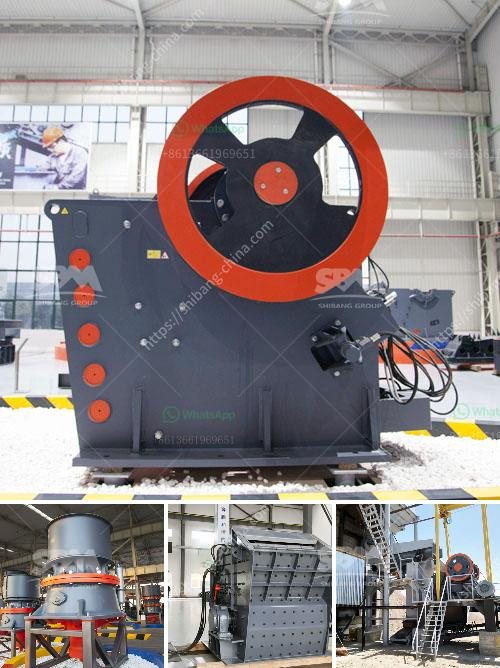

<h3>sand processing plant cost in russia</h3>
Sand is a key component in many industries, including construction, glass manufacturing, and fracking. In Russia, the demand for sand is high, particularly in regions with booming construction activities. As a result, sand processing plants have become crucial in meeting this demand, ensuring a steady supply of sand that meets the required specifications.

The cost of establishing a sand processing plant in Russia can vary depending on several factors. The size of the plant, the type of equipment and technology used, and the location are significant determinants of the overall cost. Generally, a smaller plant with basic equipment will have a lower cost, while a larger plant equipped with advanced technology will have a higher cost.

Apart from the initial investment in equipment and infrastructure, running costs such as labor, electricity, and maintenance should also be considered. Ensuring a skilled workforce is available to operate and maintain the plant efficiently is crucial for its long-term success.

Moreover, the environmental impact of sand processing plants should not be overlooked. Implementing sustainable practices, such as recycling water, controlling dust emissions, and minimizing energy consumption, can add extra costs but contribute to the overall sustainability of the plant and the surrounding environment.

Government regulations and permits also play a role in the cost of establishing a sand processing plant in Russia. Compliance with environmental and safety standards is mandatory, and meeting these requirements may involve additional expenses.

Despite the costs involved, investing in a sand processing plant in Russia can be a promising venture due to the country's high demand for sand and the potential for growth in the construction and related industries. Additionally, establishing local production facilities can reduce reliance on imported sand and create job opportunities in the region.

Ultimately, while the cost of a sand processing plant in Russia can vary, it is essential to carefully evaluate the investment, taking into account factors such as plant size, equipment, labor, maintenance, and environmental considerations. With careful planning and efficient operations, a sand processing plant can become a profitable and sustainable business venture in Russia.
<h3>Contact us</h3><ul><li><strong>Whatsapp:&nbsp;<a href="https://wa.me/8613661969651">+8613661969651</a></strong></li><li><a href="https://swt.shibang-china.com/?git&amp;zhl&amp;sand processing plant cost in russia"><strong>Online Service(chat now)</strong></a></li></ul><h3>Related</h3><ul><li><a href='crusher manufacturers in ahmedabad.md'>crusher manufacturers in ahmedabad</a></li><li><a href='coal mill manufacturers.md'>coal mill manufacturers</a></li><li><a href='bentonite powder plant in surat.md'>bentonite powder plant in surat</a></li><li><a href='stone crusher plant machinery.md'>stone crusher plant machinery</a></li><li><a href='crusher used for copper ore.md'>crusher used for copper ore</a></li></ul>