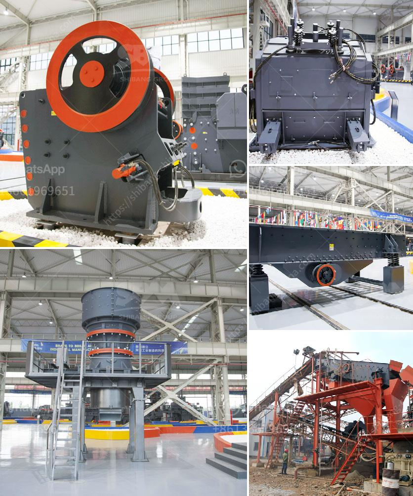

<h3>sand screen machine</h3>
Sand screening machines are an integral part of the construction industry. They are used for sorting and screening sand in various stages of the construction process. Sand screening machines are often used to separate impurities, such as rocks, stones, and debris from sand. These machines work by tumbling the sand, allowing it to pass through a screen. The oversized materials are then caught in a separate container for disposal, while the clean, reusable sand falls through the screen and collects in another container.

One of the most popular types of sand screening machines is the vibratory screening machine. This machine uses vibration to separate the sand particles into two separate classes. The vibrating motion causes the sand particles to move along and separate from the larger debris. This type of machine is effective in removing even the smallest impurities from the sand.

Another common type of sand screening machine is the rotary screening machine. This machine uses a rotating drum to separate the sand particles. As the drum rotates, the sand falls through the screen, while any larger debris stays on the outer surface of the drum and is discharged separately. This type of machine is particularly useful for screening large quantities of sand in a short period.

Sand screening machines have numerous advantages in the construction industry. They save time by efficiently separating sand from other materials. This allows construction workers to focus on other tasks, thus increasing overall productivity. The sand that is screened and collected can also be reused in various construction projects, reducing costs and minimizing environmental impact.

Furthermore, the use of sand screening machines ensures a higher quality end product. By removing impurities and debris, the sand becomes cleaner and more suitable for its intended purpose. This results in a smoother finish and enhanced durability in construction projects.

Sand screening machines are also versatile and can be used in various applications. They are commonly used in road construction, where the sand is needed as a base material for the pavement. Additionally, sand screening machines are used in the mining industry to separate valuable minerals from waste materials. By screening the sand, miners can retrieve more valuable minerals, enhancing profitability.

When choosing a sand screening machine, it is essential to consider the specific requirements of the project. Factors such as the desired capacity, the size of the sand particles, and the frequency of use should be taken into account. Additionally, the machine's durability, maintenance requirements, and power source should also be considered.

In conclusion, sand screening machines are indispensable tools in the construction industry. They efficiently separate sand from impurities, resulting in higher quality end products. These machines save time, increase productivity, and allow for the reuse of sand in various projects. Sand screening machines are versatile and can be employed in road construction, mining, and other applications. When selecting a sand screening machine, it is crucial to consider the project's requirements and the machine's specifications. By choosing the right machine, construction professionals can ensure the success and efficiency of their projects.
<h3>Contact us</h3><ul><li><strong>Whatsapp:&nbsp;<a href="https://wa.me/8613661969651">+8613661969651</a></strong></li><li><a href="https://swt.shibang-china.com/?git&amp;zhl&amp;sand screen machine"><strong>Online Service(chat now)</strong></a></li></ul><h3>Related</h3><ul><li><a href='working principle of conveyor belt.md'>working principle of conveyor belt</a></li><li><a href='cement plant equipment from china.md'>cement plant equipment from china</a></li><li><a href='hammer mill for sale in zimbabwe.md'>hammer mill for sale in zimbabwe</a></li><li><a href='belt and conveyor distributor in indonesia.md'>belt and conveyor distributor in indonesia</a></li><li><a href='jaw crusher equipment alibaba.md'>jaw crusher equipment alibaba</a></li></ul>