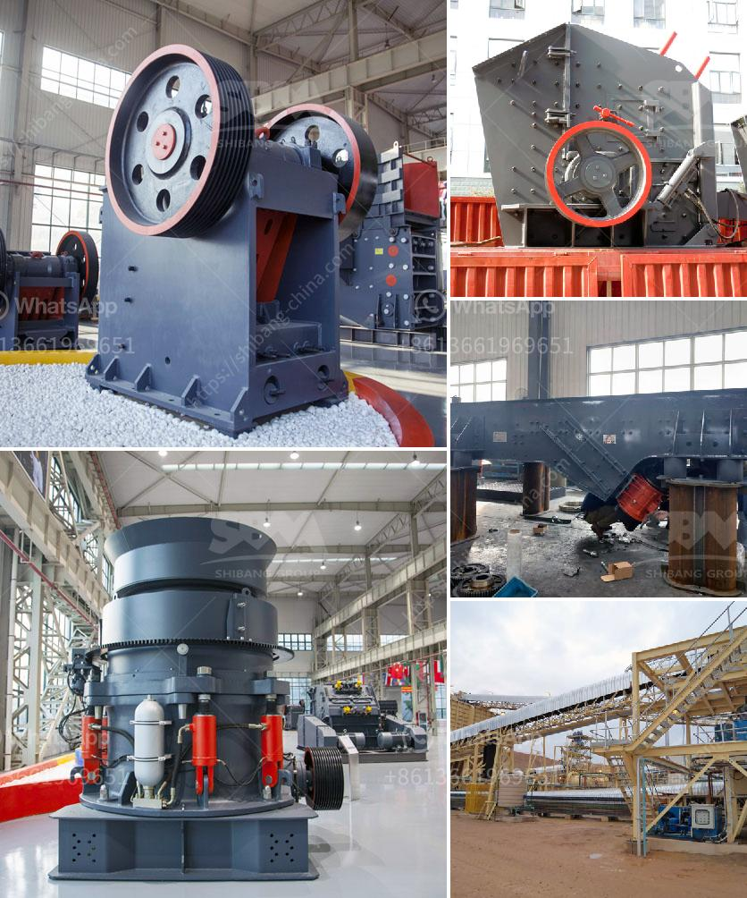

<h3>sand screening plants in south africa</h3>
Sand screening plants in South Africa are an essential resource for the construction industry as they provide the raw materials required to build structures and infrastructure. With urbanization driving the growth of South Africa’s construction sector, there is an increasing demand for building materials such as sand. A sand screening plant can be used to screen out impurities and achieve high-quality sand materials.

One of the key components of a sand screening plant is the vibrating screen, which is used to sort sand particles into different sizes. Vibrating screens are an efficient and cost-effective method of separating bulk materials such as sand and particles. Vibrating screens are widely used in industries such as mining, building materials, transportation, energy, and chemical industries to perform sizing, dewatering, and dewatering operations.

South Africa has a large number of sand screening plants, and the quality of sand screening plants in South Africa is also very high. However, some precautions must be taken when purchasing sand screening plants in South Africa. The quality of the equipment depends on many factors, such as screen size, material handling capacity, screening accuracy, and so on.

When purchasing a sand screening plant, it is essential to determine the required processing capacity. Different sand screening plants have different processing capacities, and the output and efficiency are also different. Therefore, it is necessary to select the appropriate sand screening plant according to the specific production needs to ensure the smooth progress of the construction project.

In addition, the screening accuracy of the sand screening plant is also crucial. The accuracy of the screening directly affects the quality of the sand materials. Therefore, it is necessary to choose a sand screening plant with high screening accuracy to ensure that the sand materials produced meet the construction requirements.

Another important factor to consider when purchasing a sand screening plant is the screen size. The screen size of the equipment should be compatible with the desired particle size of the sand materials. If the screen size is too small, it may cause blockages and reduce production efficiency. If the screen size is too large, it may lead to oversized materials and affect the quality of the sand materials.

Furthermore, maintenance and after-sales service are also critical factors to consider when purchasing a sand screening plant. Regular maintenance is necessary to extend the lifespan of the equipment and ensure its smooth operation. In addition, after-sales service plays a significant role in troubleshooting and resolving issues that may arise during the operation of the sand screening plant.

In conclusion, sand screening plants play a vital role in the construction industry in South Africa. With the growing demand for construction materials, high-quality sand is essential. When purchasing a sand screening plant, factors such as processing capacity, screening accuracy, screen size, maintenance, and after-sales service should be carefully considered. By selecting a suitable sand screening plant, construction companies can ensure the production of high-quality sand materials for their projects.
<h3>Contact us</h3><ul><li><strong>Whatsapp:&nbsp;<a href="https://wa.me/8613661969651">+8613661969651</a></strong></li><li><a href="https://swt.shibang-china.com/?git&amp;zhl&amp;sand screening plants in south africa"><strong>Online Service(chat now)</strong></a></li></ul><h3>Related</h3><ul><li><a href='limestone plant and machinery.md'>limestone plant and machinery</a></li><li><a href='jaw crusher parameters.md'>jaw crusher parameters</a></li><li><a href='gypsum making machinery.md'>gypsum making machinery</a></li><li><a href='marble primary crusher manufacturer.md'>marble primary crusher manufacturer</a></li><li><a href='ball mill grinding media work.md'>ball mill grinding media work</a></li></ul>