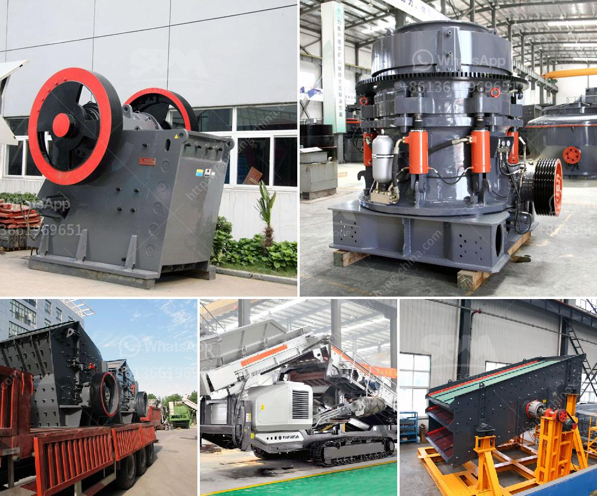

<h3>sand washers machine</h3>
Sand washers are essential machines used in the construction industry to clean and wash sand. These machines remove impurities such as dust, silt, and other unwanted particles from the sand to produce high-quality sand for various purposes.

The sand washer machine consists of a spiral sand washing unit, which is comprised of a motor, reducer, coarse material separating tank, and a fine material washing tank. As the spiral rotates, the sand is gradually and uniformly fed into the washing tank through the chute. The impurities are washed away by the action of water and are discharged along with the wastewater. On the other hand, the clean sand is taken away by the rotating spiral to complete the washing process.

Sand washers are widely used in various industries such as sand and gravel plants, mines, building materials factories, concrete mixing plants, and more. They are especially useful in regions where the sand quality is low, containing a high amount of impurities. By removing these impurities, sand washers ensure that the sand meets the requirements for use in construction projects, ensuring the strength and durability of the final product.

One of the significant advantages of using sand washers is that they are efficient and save both time and labor. They can wash large amounts of sand in a short period, eliminating the need for manual cleaning, which can be a tedious and time-consuming task. Additionally, the machines are also environmentally friendly as they recycle and reutilize water, minimizing water wastage.

Overall, sand washers play a crucial role in the construction industry by providing clean and high-quality sand. They not only save time and labor but also contribute to creating environmentally sustainable practices. With the increasing demand for quality construction materials, sand washers have become an integral part of any construction project, ensuring the production of top-notch sand.
<h3>Contact us</h3><ul><li><strong>Whatsapp:&nbsp;<a href="https://wa.me/8613661969651">+8613661969651</a></strong></li><li><a href="https://swt.shibang-china.com/?git&amp;zhl&amp;sand washers machine"><strong>Online Service(chat now)</strong></a></li></ul><h3>Related</h3><ul><li><a href='kaolin crusher price.md'>kaolin crusher price</a></li><li><a href='roll crusher price.md'>roll crusher price</a></li><li><a href='aggregate screening plants.md'>aggregate screening plants</a></li><li><a href='mode of oeration of a gyratory crusher.md'>mode of oeration of a gyratory crusher</a></li><li><a href='ball mill manufacturer in bhayander.md'>ball mill manufacturer in bhayander</a></li></ul>