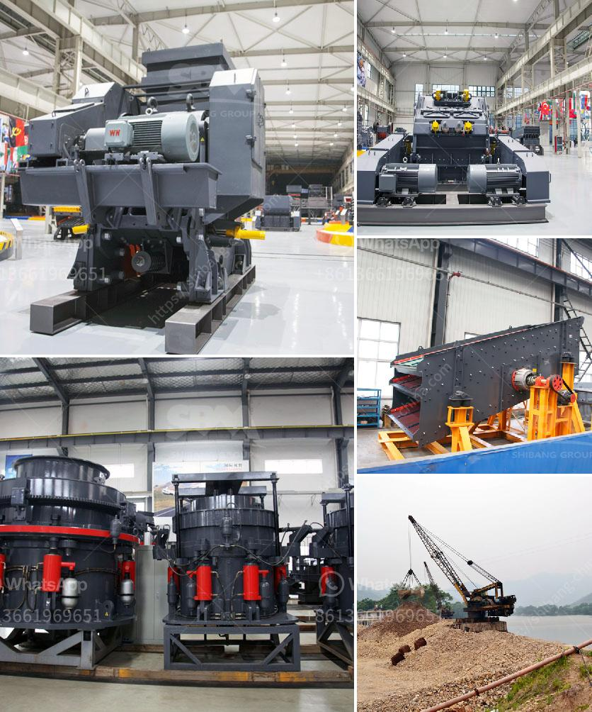

<h3>sand washing machine for sale</h3>
When it comes to buying a sand washing machine, many people are faced with the dilemma of choosing between a single or double drum. The sale of sand washing machines is popular in many countries and the sand washing machine for sale is also widely used in sand production lines. A good sand washing machine can bring considerable economic benefits to users, so choosing a suitable sand washing machine is important.

Sand washing machine is used to clean artificial sand and natural sand. It is one of the most commonly used equipment in sand production line. The sand washing machine is a high-efficiency sand washing equipment developed and produced by adopting advanced technology and combining with the actual situation of domestic sand and gravel industry.

There are mainly two types of sand washing machines: single drum and double drum. The single drum sand washing machine is more common in the sand and gravel industry, and its capacity is relatively small. However, the single drum sand washing machine has large floor space, low production capacity, and high power consumption. In contrast, the double drum sand washing machine has a large processing capacity, high washing efficiency, and low energy consumption.

In addition to the type of sand washing machine, the quality of the sand washing machine for sale is also an important factor that buyers should consider. A high-quality sand washing machine can effectively remove impurities, ensuring the cleanliness of the finished sand, and improving the quality of sand products.

1. The performance of the sand washing machine: Buyers should check the performance of the sand washing machine, such as washing capacity, washing efficiency, and power consumption. A good sand washing machine should have high washing efficiency, low power consumption, and large capacity.

2. The quality of the sand washing machine: Buyers should carefully inspect the quality of the sand washing machine, such as the materials used, the welding process, and the overall structure. A high-quality sand washing machine should be made of durable materials and have a sturdy structure to ensure a long service life.

3. After-sales service: Buyers should choose a sand washing machine manufacturer that can provide reliable after-sales service, such as technical support, equipment maintenance, and spare parts supply. Good after-sales service can solve various problems encountered during the use of the sand washing machine and ensure the normal operation of the equipment.

In conclusion, buying a sand washing machine for sale requires careful consideration. Buyers should choose the appropriate type of sand washing machine, pay attention to the quality of the equipment, and consider the after-sales service provided by the manufacturer. By following these guidelines, buyers can find a high-quality sand washing machine that meets their needs and brings considerable economic benefits.
<h3>Contact us</h3><ul><li><strong>Whatsapp:&nbsp;<a href="https://wa.me/8613661969651">+8613661969651</a></strong></li><li><a href="https://swt.shibang-china.com/?git&amp;zhl&amp;sand washing machine for sale"><strong>Online Service(chat now)</strong></a></li></ul><h3>Related</h3><ul><li><a href='coal processing plants south africa.md'>coal processing plants south africa</a></li><li><a href='fujian mill machinery plant.md'>fujian mill machinery plant</a></li><li><a href='feldspar crusher unit.md'>feldspar crusher unit</a></li><li><a href='100 tph hammer mill kenya.md'>100 tph hammer mill kenya</a></li><li><a href='process of talcum powder mill.md'>process of talcum powder mill</a></li></ul>