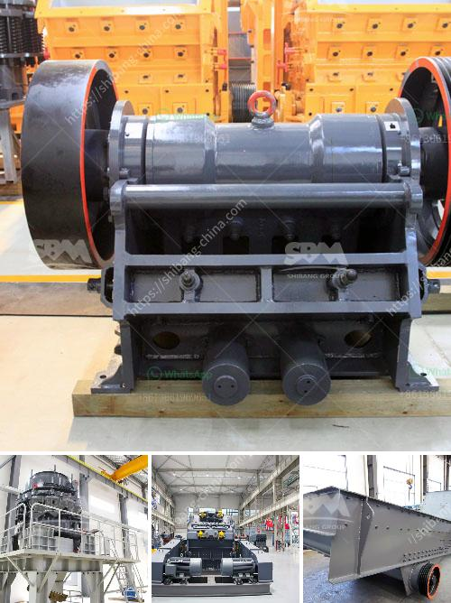

<h3>sand washing machine in sri lanka</h3>
Sand washing machine is a stone cleaning equipment that is widely used in the extractive industry to clean stone particles and impurities in sand for construction and maintenance purposes. In Sri Lanka, it has been widely used in construction sites to wash sand and gravel with high mud content, which is beyond the scope of traditional sand cleaning equipment.

Sand washing machine is designed to clean the dirt and debris in sand, thereby improving the quality of sand. After the sand is washed, the sediment concentration is reduced, and the particle size distribution becomes uniform. The sand washing machine can remove impurities covering the surface of sand and gravel, and at the same time destroy the water vapor layer covering the sand, thereby facilitating dehydration and ensuring a high-quality finished sand.

The sand washing machine industry in Sri Lanka is booming due to the high construction needs and the increasing number of sand manufacturers. As a result, there are now many different models and types of sand washing machines in the country. Most of these machines are small and medium-sized, making them ideal for small and medium-sized constructions.

The sand washing machine in Sri Lanka produced by Jianye Machinery Manufacturers is equipped with a vibrating feeder, jaw crusher, sand making machine, vibrating screen, and belt conveyor. The finished sand can meet the requirements of the construction industry. In addition, it is able to ensure the quality of the sand, thus ensuring the safety of the construction and avoiding potential hazards.

As the sand washing machine continues to accelerate construction in Sri Lanka, the demand for artificial sand by manufacturers has also increased. The sand washing machine has been favored by domestic and foreign customers in practical application, and its quality and efficiency have been recognized by the industry. Among them, the sand washing machine of Jianye Machinery Manufacturers has a higher production efficiency, and the wearing parts are made of advanced wear-resistant materials, which can greatly prolong the service life of the equipment.

In conclusion, the sand washing machine in Sri Lanka is a valuable equipment for sand production line, which can effectively increase the output, reduce waste, and bring considerable economic benefits to users. With the rapid development of construction industry, the demand for sand washing machines is also increasing. It is believed that in the near future, sand washing machine will play a more important role in Sri Lanka's construction industry.
<h3>Contact us</h3><ul><li><strong>Whatsapp:&nbsp;<a href="https://wa.me/8613661969651">+8613661969651</a></strong></li><li><a href="https://swt.shibang-china.com/?git&amp;zhl&amp;sand washing machine in sri lanka"><strong>Online Service(chat now)</strong></a></li></ul><h3>Related</h3><ul><li><a href='the cost of a clay brick making machine in south africa.md'>the cost of a clay brick making machine in south africa</a></li><li><a href='vertical ball mill with price.md'>vertical ball mill with price</a></li><li><a href='stone crusher machine for sale in kenya.md'>stone crusher machine for sale in kenya</a></li><li><a href='mobile crushing plant canada.md'>mobile crushing plant canada</a></li><li><a href='rodillos para trituradoras en bogota.md'>rodillos para trituradoras en bogota</a></li></ul>