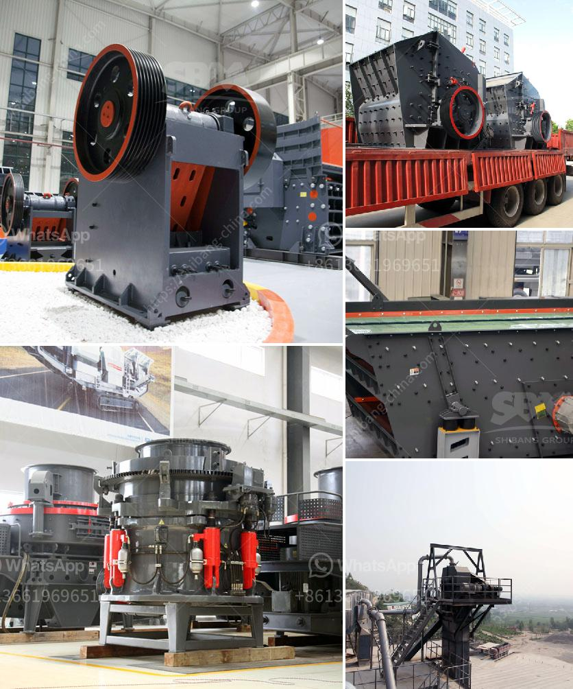

<h3>sand washing plant for sale in south africa</h3>
Sand washing plant for sale in South Africa is a whole production line integrating crushing, classifying and sand washing. Based on the principle and production capacity of sand washer, combined with the actual situation of domestic sand production, our company has developed high-efficiency sandstone cleaning and screening equipment with domestic, international and industry-leading level.

In the past few years, with the rapid development of construction industry, urbanization process and the rise of the real estate industry, the demand for sand and gravel in South Africa is growing and its price is also increasing. As a result, many investors are turning their attention to sand washing plant for sale in South Africa.

In South Africa, sand washing plant manufacturers have been more and more as sand washing machines in the South Africa. The development of sand washing machine is to better serve the market, making sandstone products more in line with the requirements of the market. In this case, sand washing plant for sale South Africa is in great demand.

It has a wide range of applications, including washing, grading, dewatering and fine-grained materials recovery. The sand washing plant for sale in South Africa is of high quality and reasonable price, and the investors have been in the industry for many years. The sand washing plant is characterized by low cost, strong processing ability, convenient maintenance and high washing degree.

The sand washing plant is widely used in sand and gravel production line, so it is inevitable that there will be the phenomenon of failure in operation. However, the abnormal signal of the sand washing machine in production will still cause great inconvenience to the user. In this case, please call the technical personnel of the sand washing plant for sale in South Africa to repair and maintain the equipment as soon as possible.

In addition, when the sand washing plant for sale in South Africa is purchased, the technical staff will take you to install and debug the equipment, providing you with comprehensive services throughout the entire purchase process. If you have any questions during use, you can contact the technical personnel through the after-sales service hotline, and they will solve the problem for you as soon as possible.

In summary, the sand washing plant for sale in South Africa is a kind of special production line for the production of sand and stone materials for construction, highway, railway and other industries. The main equipment of the sand washing plant is sand washing machine. The sand washing machine of our company is durable and wear-resistant, with high efficiency and low technical content. This sand washing plant has been widely used in various industries.
<h3>Contact us</h3><ul><li><strong>Whatsapp:&nbsp;<a href="https://wa.me/8613661969651">+8613661969651</a></strong></li><li><a href="https://swt.shibang-china.com/?git&amp;zhl&amp;sand washing plant for sale in south africa"><strong>Online Service(chat now)</strong></a></li></ul><h3>Related</h3><ul><li><a href='feldspar grinding mill suppliers india.md'>feldspar grinding mill suppliers india</a></li><li><a href='gypsum grinding machine.md'>gypsum grinding machine</a></li><li><a href='manganese mobile processing plants.md'>manganese mobile processing plants</a></li><li><a href='feasibility studies on lead ore processing.md'>feasibility studies on lead ore processing</a></li><li><a href='stone crusher plant indonesia.md'>stone crusher plant indonesia</a></li></ul>