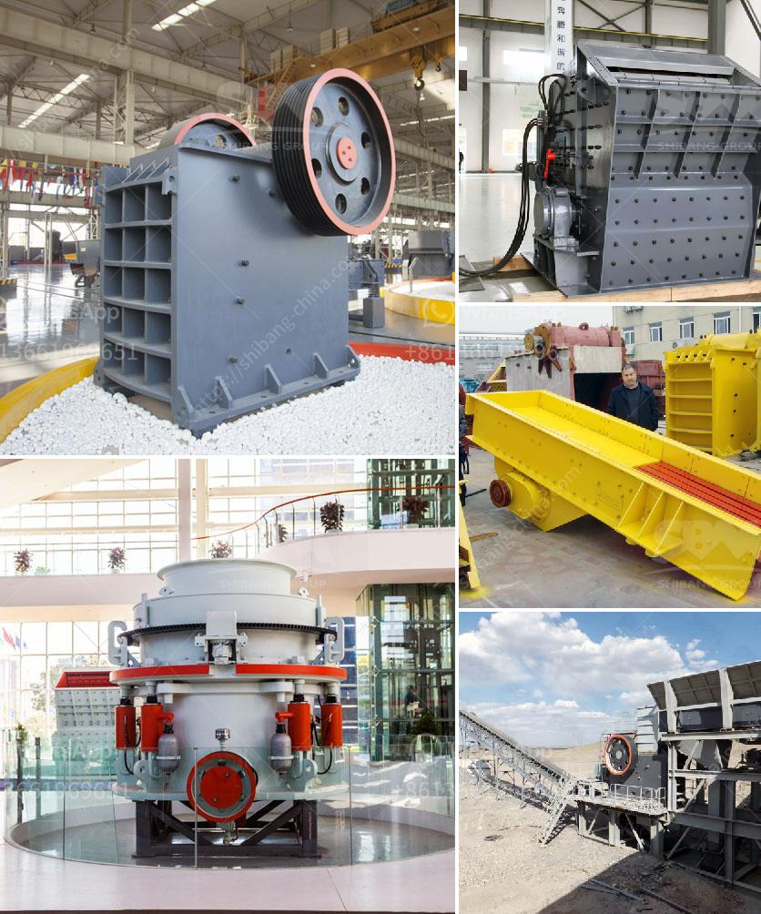

<h3>sand washing plant in turkey</h3>
Sand washing plant in Turkey is a hot topic these days. The rapidly increasing population in Turkey has created a huge demand for construction materials, including sand. In order to meet this demand, many investors have invested in sand washing plants, one of the most popular investments in the country.

A sand washing plant is a facility designed to remove impurities such as clay, silt, and dust from sand to produce cleaner, more usable sand. This process involves the use of water and various mechanical devices to remove these contaminants and create a high-quality sand product.

Turkey, with its vast coastline and numerous rivers, has an abundant supply of sand. However, the natural sand available is not always suitable for construction purposes due to the presence of impurities. This is where sand washing plants play a crucial role. These plants ensure that the sand used in construction projects is clean, free from impurities, and conforms to quality standards.

The sand washing plants in Turkey use advanced technology and unique designs to effectively remove unwanted materials and produce high-quality sand. These plants often consist of a series of screens, crushers, and washing units, each performing a specific task in the cleaning process. Some plants even incorporate water recycling systems to minimize water consumption and reduce environmental impact.

Investing in a sand washing plant in Turkey has proven to be a profitable venture for many investors. The demand for sand continues to rise in the country, driven by ongoing construction projects and infrastructure development. With the proper operation and maintenance, sand washing plants can generate significant returns on investment in a relatively short period.

In conclusion, sand washing plants in Turkey are making a notable contribution to meeting the growing demand for clean and usable sand in the construction industry. These plants are equipped with advanced technology and offer an efficient solution for removing impurities from sand. With the increasing demand for sand in Turkey, investing in a sand washing plant can be a lucrative business opportunity.
<h3>Contact us</h3><ul><li><strong>Whatsapp:&nbsp;<a href="https://wa.me/8613661969651">+8613661969651</a></strong></li><li><a href="https://swt.shibang-china.com/?git&amp;zhl&amp;sand washing plant in turkey"><strong>Online Service(chat now)</strong></a></li></ul><h3>Related</h3><ul><li><a href='difference between residual and transported soil.md'>difference between residual and transported soil</a></li><li><a href='crush cobble machine.md'>crush cobble machine</a></li><li><a href='crusher in china.md'>crusher in china</a></li><li><a href='ballast stone crusher in india.md'>ballast stone crusher in india</a></li><li><a href='copper ore concentrator price.md'>copper ore concentrator price</a></li></ul>