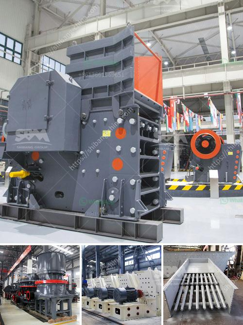

<h3>sand washing plants in india</h3>
Sand washing plants are used to remove impurities from the surface of sand and gravel, providing a cleaner and more refined product for construction purposes. In India, sand washing plants have become the need of the hour, considering the excessive mining of riverbed sand that has disrupted the balance of ecosystems.

India is a developing nation with a rapidly growing population, and the demand for housing and infrastructure is escalating at an unprecedented rate. Consequently, the construction industry is flourishing, resulting in a substantial requirement for high-quality sand. Traditionally, riverbed sand has been the primary source of construction sand in India. However, the excessive mining of riverbed sand has led to ecological imbalances, including threats to rivers, aquatic life, and even human habitation in certain areas.

To combat these issues, sand washing plants have emerged as an eco-friendly solution. These plants effectively remove silt, clay, and other impurities from the sand, making it suitable for construction purposes. Additionally, sand washing plants can increase the strength and durability of the sand, ensuring a higher-quality end product. This is particularly important in projects such as concrete production, where the quality of sand directly impacts the strength and durability of the final structure.

Moreover, sand washing plants can significantly reduce water consumption compared to traditional methods of sand cleaning. These plants employ water recycling systems, where the water used during the washing process is treated, filtered, and reused. This not only conserves water but also saves costs associated with freshwater usage. Considering the scarcity of water in certain parts of India, water-saving technologies are of utmost importance, and sand washing plants provide an effective solution in this regard.

The use of sand washing plants in India has gained substantial traction in recent years. Various state governments and environmental bodies have been actively promoting the use of washed sand instead of riverbed sand. For instance, the National Green Tribunal (NGT), a key environmental authority in India, has banned the mining of riverbed sand without environmental clearance. This has forced the construction industry to seek alternative sources of sand, resulting in a surge in the adoption of sand washing plants.

Furthermore, sand washing plants contribute to the overall sustainable development agenda of the country. By reducing the exploitation of riverbed sand, these plants help preserve natural resources and protect fragile ecosystems. Moreover, the adoption of sand washing plants aligns with India's commitment to the United Nations Sustainable Development Goals, particularly Goal 6 (Clean Water and Sanitation) and Goal 13 (Climate Action).

In conclusion, sand washing plants have become an integral part of India's construction industry, providing a sustainable and eco-friendly solution to the excessive mining of riverbed sand. These plants not only enhance the quality of sand but also help conserve water and protect natural resources. With the growing emphasis on sustainable development in the country, the adoption of sand washing plants is expected to increase even further in the coming years.
<h3>Contact us</h3><ul><li><strong>Whatsapp:&nbsp;<a href="https://wa.me/8613661969651">+8613661969651</a></strong></li><li><a href="https://swt.shibang-china.com/?git&amp;zhl&amp;sand washing plants in india"><strong>Online Service(chat now)</strong></a></li></ul><h3>Related</h3><ul><li><a href='sand and gravel wash plants usa.md'>sand and gravel wash plants usa</a></li><li><a href='stone crushing machine prices za.md'>stone crushing machine prices za</a></li><li><a href='hammer mill aluminum slag.md'>hammer mill aluminum slag</a></li><li><a href='roll mills supplier in karachi.md'>roll mills supplier in karachi</a></li><li><a href='stone crusher unit project report.md'>stone crusher unit project report</a></li></ul>