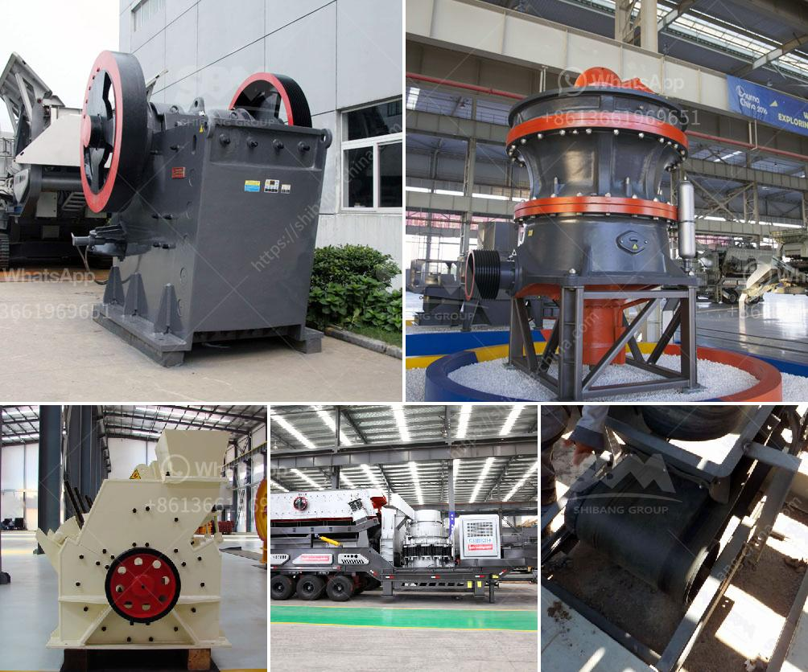

<h3>sayaji crusher price</h3>
Crusher machines play a crucial role in the mining and construction industries. They are designed to reduce the size of large rocks, gravel, or other solid materials into smaller, more manageable pieces. Sayaji Crushers are specifically created to meet the diverse needs of a customer, ensuring efficient operation and minimal downtime.

When it comes to purchasing a Sayaji Crusher, price is often a determining factor. However, it is essential to understand that while price is important, it should not be the sole deciding factor. Quality, performance, and reliability are equally critical aspects to consider. This article will guide you through the various factors to consider when looking for the right Sayaji Crusher at the best price.

The first step is to clearly identify your specific needs and requirements. Determine the type and size of material you need to process. Assess the maximum feed size, desired output size, and production capacity. This information will help you select the appropriate Sayaji Crusher model that is best suited for your application.

Investing in a high-quality Sayaji Crusher ensures durability and longevity. Check the manufacturing standards followed by the brand you are considering. Look for features like heavy-duty construction, quality materials, and advanced technology. A well-built Crusher will deliver better performance and require less maintenance, resulting in higher productivity.

Once you have shortlisted a few potential options, compare the prices of Sayaji Crushers available in the market. Consider the included features, such as motor power, operating cost, and after-sales service. Keep in mind that comparing prices alone is not enough; it should be considered along with the overall product quality.

A reliable after-sales support system is essential when purchasing any machinery or equipment. Find out if the brand offers technical assistance, spare parts availability, and regular maintenance. An established brand will have a robust network of service centers, ensuring quick and efficient support when needed.

Seek feedback from other customers who have used Sayaji Crushers. Read reviews and testimonials to get an insight into their experiences with the product and the brand. Positive feedback and recommendations can be an excellent indicator of the crusher's quality, performance, and reliability.

While it is wise to invest in a high-quality Sayaji Crusher, it is essential to stay within your budget. Determine your financial limits and balance the desired features with the available budget. It is important not to compromise on quality and performance solely based on price, as it may cost more in the long run.

In conclusion, purchasing a Sayaji Crusher requires careful consideration of various factors. The price is an important aspect, but it should not overshadow the overall quality, performance, and after-sales support. Take your time to research and compare different models and brands to ensure you choose the best crusher equipment that meets your needs without breaking the bank.
<h3>Contact us</h3><ul><li><strong>Whatsapp:&nbsp;<a href="https://wa.me/8613661969651">+8613661969651</a></strong></li><li><a href="https://swt.shibang-china.com/?git&amp;zhl&amp;sayaji crusher price"><strong>Online Service(chat now)</strong></a></li></ul><h3>Related</h3><ul><li><a href='components for cone crusher major.md'>components for cone crusher major</a></li><li><a href='crushing plants suppliers sales in nigeria.md'>crushing plants suppliers sales in nigeria</a></li><li><a href='quartz ball mill manufacturer hyderabad.md'>quartz ball mill manufacturer hyderabad</a></li><li><a href='gypsum factory in pakistan.md'>gypsum factory in pakistan</a></li><li><a href='crusher plant cost in pakistan.md'>crusher plant cost in pakistan</a></li></ul>