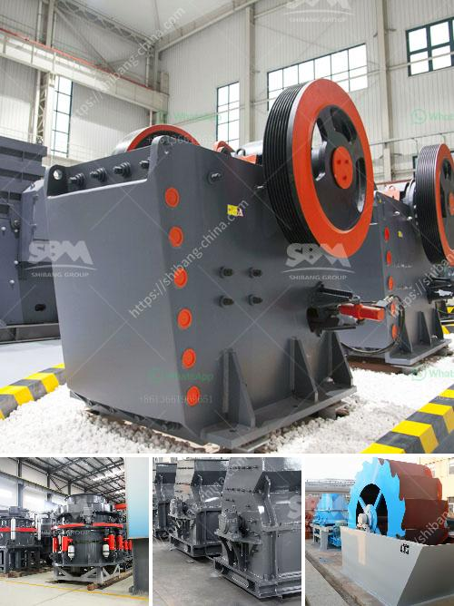

<h3>screen for iron ore pellets</h3>
In the mining industry, screening plays a crucial role in separating valuable minerals from waste materials. When it comes to iron ore pellets, an efficient screening process is essential to ensure the high quality of the final product. With advancements in technology, screens designed specifically for iron ore pellets have emerged as a game-changer in mining operations.

Iron ore pellets are small spheres made from iron ore fines, which are ground into a powder and then consolidated into various pellet sizes. These pellets serve as a raw material for blast furnaces in the steel-making industry. To ensure the quality and consistency of iron ore pellets, it is vital to accurately separate oversized particles, undersized fines, and dust during the screening process.

Traditionally, screening iron ore pellets involved the use of heavy-duty screens with large mesh sizes. However, these conventional screens often faced challenges such as blinding, clogging, and inefficient separation. These issues not only reduced the overall efficiency of the screening process but also compromised the final product quality.

To overcome these challenges, modern screens for iron ore pellets have been developed with several essential features. Firstly, these screens employ advanced mesh technologies that can withstand high feed rates, reducing the risk of blinding and clogging. This ensures uninterrupted screening operations and increased throughput.

Furthermore, the design of these screens allows for efficient particle separation. The use of multi-deck screens enables multiple cuts to be made simultaneously, resulting in accurate particle size distribution. This ensures that the iron ore pellets are correctly sized, meeting the desired specifications required by steel manufacturers.

Additionally, the use of anti-blocking systems in modern screen designs minimizes the buildup of fines and dust, optimizing the screening process. These systems employ various techniques such as vibration, mechanical brushes, and air jets to prevent material from sticking to the mesh surface. As a result, the screens remain clear, maximizing their screening efficiency and prolonging their lifespan.

Moreover, advancements in screen technology have introduced screens with self-cleaning capabilities. These screens are equipped with flexible panels that are able to constantly flex under the impact of particles, dislodging any material that adheres to the mesh. This self-cleaning feature ensures continuous operation without interruptions for cleaning, thus increasing productivity and reducing maintenance downtime.

The benefits of using advanced screens for iron ore pellets extend beyond enhancing efficiency. Improved screening processes contribute to a higher-quality final product. Ensuring that the pellets are free from oversized particles and impurities leads to a more uniform chemical composition and physical properties. This, in turn, enhances the performance and reduces the material consumption in the steel-making process.

In conclusion, the development of screens specifically designed for iron ore pellets has revolutionized the screening process in mining operations. These screens overcome traditional challenges, such as blinding, clogging, and inefficient separation, by employing advanced mesh technologies, anti-blocking systems, and self-cleaning features. The use of modern screens enhances both the efficiency and quality of the screening process, leading to improved productivity and a higher-quality final product. As the mining industry continues to evolve, the adoption of these advanced screens for iron ore pellets will undoubtedly become a standard practice in mining operations worldwide.
<h3>Contact us</h3><ul><li><strong>Whatsapp:&nbsp;<a href="https://wa.me/8613661969651">+8613661969651</a></strong></li><li><a href="https://swt.shibang-china.com/?git&amp;zhl&amp;screen for iron ore pellets"><strong>Online Service(chat now)</strong></a></li></ul><h3>Related</h3><ul><li><a href='small quartz appratus for crushing.md'>small quartz appratus for crushing</a></li><li><a href='philippines crusher cebu crusher.md'>philippines crusher cebu crusher</a></li><li><a href='quarry dan peralatan yang dibutuhkan.md'>quarry dan peralatan yang dibutuhkan</a></li><li><a href='bentonite powder plant in surat.md'>bentonite powder plant in surat</a></li><li><a href='china mobile stone crusher machine.md'>china mobile stone crusher machine</a></li></ul>