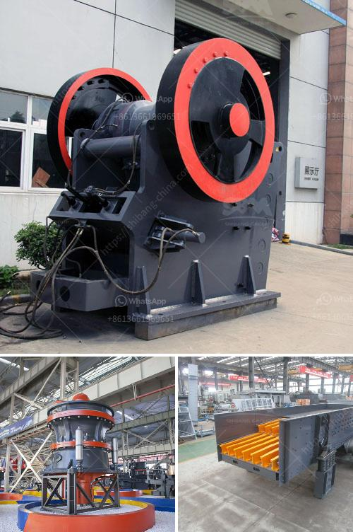

<h3>screw conveyor design calculation</h3>
Screw conveyors are a useful tool for moving and transferring bulk materials from one location to another. These mechanical devices have a helical screw blade, or auger, that rotates and transports materials by engulfing them in a rotating, spiral motion. Screw conveyors are commonly used in industries such as agriculture, food processing, mining, and chemical processing.

One of the critical aspects of designing a screw conveyor system is calculating the necessary capacity and power requirements. This calculation process involves determining the material flow rate, conveyor length, diameter, gear ratio, and motor power needed to operate the system efficiently.

The first step in screw conveyor design calculation is determining the capacity. This involves considering the bulk density and desired throughput of the material being conveyed. Bulk density refers to the weight of the material per unit volume, typically measured in kilograms per cubic meter (kg/m3). By multiplying the bulk density by the desired throughput in kilograms per hour (kg/h), you can determine the required capacity in cubic meters per hour (m3/h).

Once the capacity has been determined, the next step is to calculate the conveyor diameter. The diameter of the screw conveyor influences its handling capacity and power requirements. A larger diameter allows for higher capacity but also requires a more powerful motor to drive the system. Standard screw conveyor sizes range from 150mm to 600mm in diameter, depending on the application and material being conveyed.

The conveyor length is another critical factor to consider in the calculation process. The length determines the overall size and layout of the system. Longer conveyors may require additional supports and drive systems to ensure stability and efficiency. Furthermore, longer conveyors will also result in higher power requirements to overcome frictional losses.

In addition to these parameters, the gear ratio and motor power must be calculated to determine the required power for the system. The gear ratio reflects the speed reduction achieved between the motor and the screw conveyor. This reduction is necessary to match the speed of the motor with the desired conveyor speed. Determining the gear ratio involves considering the speed of the motor, the desired conveyor speed, and the diameter of the screw conveyor.

Once the gear ratio is known, the motor power can be calculated. This calculation involves considering factors such as the conveyor length, the material characteristics, and the required capacity. Proper motor sizing ensures that the screw conveyor operates efficiently, avoiding unnecessary wear and tear on the system.

In conclusion, the design of a screw conveyor involves several calculations to determine the proper capacity, conveyor length, diameter, gear ratio, and motor power. These factors need to be carefully considered to ensure the efficient and reliable operation of the system. Screw conveyors play a vital role in various industries, and the correct design calculations are essential for successful application and optimization of these mechanical devices.
<h3>Contact us</h3><ul><li><strong>Whatsapp:&nbsp;<a href="https://wa.me/8613661969651">+8613661969651</a></strong></li><li><a href="https://swt.shibang-china.com/?git&amp;zhl&amp;screw conveyor design calculation"><strong>Online Service(chat now)</strong></a></li></ul><h3>Related</h3><ul><li><a href='south africa ballast crushing companies.md'>south africa ballast crushing companies</a></li><li><a href='indonesia copper processing equipment for sale.md'>indonesia copper processing equipment for sale</a></li><li><a href='crushing plant equipment.md'>crushing plant equipment</a></li><li><a href='prices of hammer mill in zimbabwe.md'>prices of hammer mill in zimbabwe</a></li><li><a href='copper ore processing machines in usa.md'>copper ore processing machines in usa</a></li></ul>